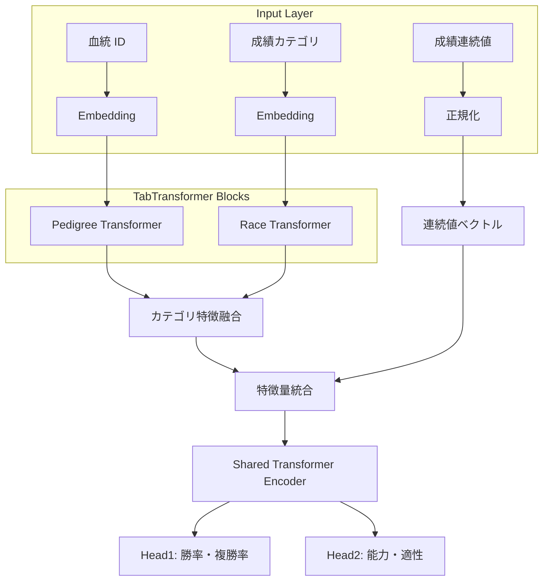
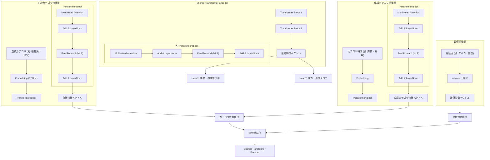

# 競走馬能力予測システム設計書 <br> (Design Document for Racehorse Performance Prediction System)

---

- **作成日 :** 2025-07-20
- **最終更新日 :** 2025-07-27
- **バージョン :** 1.1
- **作成者 :** Akkyun
- **連絡先 :** kate387312@gmail.com

---

## 0. 目次

- [競走馬能力予測システム設計書  (Design Document for Racehorse Performance Prediction System)](#競走馬能力予測システム設計書--design-document-for-racehorse-performance-prediction-system)
  - [0. 目次](#0-目次)
  - [1. はじめに (Introduction)](#1-はじめに-introduction)
  - [2. システムアーキテクチャ概要 (System Architecture Overview)](#2-システムアーキテクチャ概要-system-architecture-overview)
    - [2.1. データ入力と特徴量](#21-データ入力と特徴量)
    - [2.2. モデルの中核](#22-モデルの中核)
    - [2.3. 予測出力](#23-予測出力)
    - [2.4. 開発および運用環境の方向性](#24-開発および運用環境の方向性)
  - [3. 目的 (Objective)](#3-目的-objective)
  - [4. 入力特徴量ベクトル (Input Feature Vector)](#4-入力特徴量ベクトル-input-feature-vector)
    - [4.1. 血統情報](#41-血統情報)
      - [4.1.1. 種牡馬情報 (Sire Pedigree Vector)](#411-種牡馬情報-sire-pedigree-vector)
      - [4.1.2. 種牡馬系統情報 (Sire Lineage Vector)](#412-種牡馬系統情報-sire-lineage-vector)
      - [4.1.3. 系統クロス情報](#413-系統クロス情報)
      - [4.1.4. 系統ニックス情報](#414-系統ニックス情報)
    - [4.2. 競走成績情報](#42-競走成績情報)
      - [4.2.1. 連続値による特徴量表現の補足](#421-連続値による特徴量表現の補足)
      - [4.2.2. z-score に関する補足](#422-z-score-に関する補足)
    - [4.3. 入力データの前処理](#43-入力データの前処理)
      - [4.3.1. 欠損値処理](#431-欠損値処理)
      - [4.3.2. 外れ値処理](#432-外れ値処理)
      - [4.3.3. カテゴリ変数のエンコーディング](#433-カテゴリ変数のエンコーディング)
      - [4.3.4. 数値スケーリング](#434-数値スケーリング)
      - [4.3.5. 特徴量の統合とテンソル変換](#435-特徴量の統合とテンソル変換)
  - [5. 出力特徴量ベクトル (Target Feature)](#5-出力特徴量ベクトル-target-feature)
    - [5.1. レース情報による勝率/複勝率の予測タスク](#51-レース情報による勝率複勝率の予測タスク)
      - [5.1.1. 入力値](#511-入力値)
      - [5.1.2. 出力値](#512-出力値)
    - [5.2. 血統情報による能力・適性の予測タスク](#52-血統情報による能力適性の予測タスク)
      - [5.2.1. 入力値](#521-入力値)
      - [5.2.2. 出力値](#522-出力値)
  - [6. 入出力ベクトル仕様定義 (Input/Output Vector Specification)](#6-入出力ベクトル仕様定義-inputoutput-vector-specification)
    - [6.1. 入力ベクトルの共通仕様](#61-入力ベクトルの共通仕様)
      - [6.1.1. データ型と表現形式](#611-データ型と表現形式)
      - [6.1.2. ベクトル結合順序と全体構成](#612-ベクトル結合順序と全体構成)
      - [6.1.3. 正規化・スケーリング方針](#613-正規化スケーリング方針)
      - [6.1.4. 欠損値処理方針](#614-欠損値処理方針)
    - [6.2. 入力ベクトルカテゴリ別仕様](#62-入力ベクトルカテゴリ別仕様)
      - [6.2.1. 血統ベクトル仕様](#621-血統ベクトル仕様)
      - [6.2.2. 競走成績ベクトル仕様](#622-競走成績ベクトル仕様)
    - [6.3. 出力ベクトルの共通仕様](#63-出力ベクトルの共通仕様)
      - [6.3.1. マルチヘッド構成](#631-マルチヘッド構成)
      - [6.3.2. 出力テンソル構造](#632-出力テンソル構造)
      - [6.3.3. 損失関数設計](#633-損失関数設計)
    - [6.4. 出力ベクトルカテゴリ別仕様](#64-出力ベクトルカテゴリ別仕様)
      - [6.4.1. 勝率 / 複勝率ベクトル仕様 (Head1)](#641-勝率--複勝率ベクトル仕様-head1)
      - [6.4.2. 能力 / 適性スコアベクトル仕様 (Head2)](#642-能力--適性スコアベクトル仕様-head2)
    - [6.5. 入出力対応関係と整合性確認](#65-入出力対応関係と整合性確認)
      - [6.5.1. 入出力の対応関係](#651-入出力の対応関係)
      - [6.5.2. 教師データとの結合例](#652-教師データとの結合例)
      - [6.5.3. 学習フェーズと推論フェーズの違い](#653-学習フェーズと推論フェーズの違い)
    - [6.6. マルチタスク出力における評価指標一覧](#66-マルチタスク出力における評価指標一覧)
    - [6.7. 実装上の留意点](#67-実装上の留意点)
      - [6.6.1. モデルへのテンソル変換時の Shape と構造](#661-モデルへのテンソル変換時の-shape-と構造)
      - [6.6.2. Embedding 層の学習有無](#662-embedding-層の学習有無)
      - [6.6.3. スケーリングと損失関数の整合性](#663-スケーリングと損失関数の整合性)
  - [7. 学習データ構築 (Data Construction)](#7-学習データ構築-data-construction)
    - [7.1. データセットの設計方針](#71-データセットの設計方針)
      - [7.1.1 特徴量設計ポリシー](#711-特徴量設計ポリシー)
    - [7.2. 入力特徴量設計](#72-入力特徴量設計)
    - [7.3. 教師信号設計](#73-教師信号設計)
    - [7.4. データ収集と前処理・ベクトル化](#74-データ収集と前処理ベクトル化)
    - [7.5. データの分割戦略 (Train / Validation / Test)](#75-データの分割戦略-train--validation--test)
    - [7.6. 保存形式とロード設計](#76-保存形式とロード設計)
    - [7.7. データの整合性確認と検証](#77-データの整合性確認と検証)
  - [8. モデル設計 (Model Architecture)](#8-モデル設計-model-architecture)
    - [8.1. モデル全体構造の概要](#81-モデル全体構造の概要)
    - [8.2. 入力層とベクトル処理](#82-入力層とベクトル処理)
      - [8.2.1. 血統情報の処理](#821-血統情報の処理)
      - [8.2.2. 成績情報の処理](#822-成績情報の処理)
      - [8.2.3. 位置エンコーディング](#823-位置エンコーディング)
    - [8.3 Encoder 構造 (Transformer)](#83-encoder-構造-transformer)
      - [8.3.1 Encoder アーキテクチャ](#831-encoder-アーキテクチャ)
      - [8.3.2 Self-Attention 機構](#832-self-attention-機構)
      - [8.3.3 推奨ハイパーパラメータ](#833-推奨ハイパーパラメータ)
      - [8.3.4 ファインチューニング戦略](#834-ファインチューニング戦略)
    - [8.4 出力ヘッド構造](#84-出力ヘッド構造)
      - [8.4.1. Head1: 勝率・複勝率予測](#841-head1-勝率複勝率予測)
      - [8.4.2. Head2: 能力・適性スコア予測](#842-head2-能力適性スコア予測)
    - [8.5 学習戦略と最適化](#85-学習戦略と最適化)
      - [8.5.1. マルチタスク損失関数](#851-マルチタスク損失関数)
      - [8.5.2. 正則化と学習安定化](#852-正則化と学習安定化)
      - [8.5.3. 評価指標](#853-評価指標)
    - [8.6 パラメータ初期化戦略](#86-パラメータ初期化戦略)
      - [8.6.1. Embedding 初期化](#861-embedding-初期化)
      - [8.6.2. 出力層の初期化](#862-出力層の初期化)
  - [9. 応用・意義・今後の展望 (Applications, Significance, and Future Prospects)](#9-応用意義今後の展望-applications-significance-and-future-prospects)
    - [9.1. 応用と利用シーン](#91-応用と利用シーン)
    - [9.2. 本システムの意義と価値](#92-本システムの意義と価値)
    - [9.3. 今後の展望と拡張性](#93-今後の展望と拡張性)
  - [10. 付録 (Appendix)](#10-付録-appendix)
    - [10.1. データスキーマ詳細](#101-データスキーマ詳細)
      - [10.1.1. 血統情報データ構造](#1011-血統情報データ構造)
      - [10.1.2. 競走成績データ構造](#1012-競走成績データ構造)
    - [10.2. 前処理パイプライン](#102-前処理パイプライン)
      - [10.2.1. データクレンジング](#1021-データクレンジング)
      - [10.2.2. カテゴリ変数のエンコーディング方法 (Embedding の詳細)](#1022-カテゴリ変数のエンコーディング方法-embedding-の詳細)
      - [10.2.3. 連続値の正規化手法 (Z-score 等)](#1023-連続値の正規化手法-z-score-等)
      - [10.2.4. 位置エンコーディング実装仕様](#1024-位置エンコーディング実装仕様)
    - [10.3. ハイパーパラメータ設定一覧](#103-ハイパーパラメータ設定一覧)
    - [10.4. 使用技術・ライブラリ](#104-使用技術ライブラリ)
    - [10.5. ディレクトリ構成とファイル仕様](#105-ディレクトリ構成とファイル仕様)
    - [10.6. モデル学習・推論の運用手順](#106-モデル学習推論の運用手順)
    - [10.7. 数学的手法の詳細](#107-数学的手法の詳細)

---

## 1. はじめに (Introduction)

- 本設計書は、競走馬の能力を血統と競走成績から予測するシステムの設計に関する内容をまとめたものである。
- 近年の競馬データ解析技術の発展と機械学習モデルの進化は、従来の主観的な予測手法に代わる、より客観的かつ高精度な能力評価の可能性を示している。
- 本システムは、これらの技術的進歩を背景に、特に Transformer モデルを構造化データへ適用し、血統と競走成績の複合的な非線形関係を深掘りすることで、競走馬の潜在能力と適性をより精密に評価することを目的とする。
- このアプローチにより、既存の予測手法では捉えきれなかった新たな洞察を提供し、予測精度の飛躍的な向上を目指す。
- 本設計書は、開発者、データサイエンティスト、および本システムの導入を検討するビジネス関係者を主な対象とする。システムの全体概要から、具体的なデータ構造、モデルアーキテクチャ、そして将来的な応用可能性に至るまでを詳述する。

---

## 2. システムアーキテクチャ概要 (System Architecture Overview)

本システムは、血統と競走成績という二つの主要なデータソースを統合的に活用し、競走馬の潜在能力と多様な適性 (距離、路盤、競馬場、馬場状態など) を客観的かつ定量的に評価することを目的としている。これにより、従来の主観的な評価に代わる、より精密な能力予測を実現する。データは定期的に収集され、前処理パイプラインを経て特徴量ベクトルに変換後、モデルに入力される。

---

### 2.1. データ入力と特徴量

入力データには、競走馬の 5 代血統表に基づく詳細な血統情報 (種牡馬血統、系統分類、クロス情報、ニックス情報) と、過去 5 年分のレース成績データを用いる。これらの膨大なデータは、モデルが学習するための重要な特徴量として機能する。

---

### 2.2. モデルの中核

---

本システムの中核を担うのは、Transformer を活用した深層学習モデルである。特に構造化データ処理に特化した TabTransformer を採用し、入力された血統情報と競走成績データから、競走馬の能力に関する複雑なパターンや非線形な関係性を高精度に学習する。精緻な血統解析と最新のレースデータを組み合わせることで、より高精度な能力予測を目指す。

---

### 2.3. 予測出力

モデルの出力は、競走馬の能力を多角的に示す 50 項目の能力指標ベクトルで表現される。これには、各適性に応じた連続値やカテゴリ評価が含まれ、馬券購入支援から育成・調教戦略立案に至るまで、幅広い用途での活用を可能にする。

---

### 2.4. 開発および運用環境の方向性

本システムは、主要な開発言語として Python を用いる。深層学習フレームワークについては、柔軟性と拡張性を考慮し、現時点では PyTorch と TensorFlow のいずれかを採用することを検討中である。現在の開発はローカル環境を主軸に進めているが、将来的には本システムを Web API として提供することで、リアルタイムでの予測提供や、他システムとの連携によるサービス拡張を図ることを視野に入れている。

---

## 3. 目的 (Objective)

本システムは、競走馬の能力予測において以下の具体的な目的を達成し、競馬に関わる多様なステークホルダーに新たな価値を提供することを目指す。

- 血統情報と競走成績を組み合わせた統合的な能力評価モデルを構築すること。これにより、従来の主観的な評価を排除し、客観的かつ網羅的なデータに基づく高精度な予測を可能にする。
- 競走馬の距離適性、馬場適性、成長傾向など多角的な能力指標を数値化し、定量的に分析可能にすること。これにより、育成・調教戦略の最適化や、競走馬の適性に応じた出走ローテーションの策定を支援し、潜在能力を最大限に引き出す。
- 血統系統を用いた、精緻な血統解析により、系統クロスやニックスの影響を考慮し、競走馬のパフォーマンス予測の精度向上を図ること。具体的には、複勝率予測の AUC-ROC を既存手法と比較して X%向上させることを目標とする。これにより、馬券購入者への客観的情報提供を強化し、的中率向上に貢献する。
- 過去の膨大なレースデータを活用し、実践的かつ最新の能力評価モデルを実現すること。これにより、市場における競走馬の価値評価に貢献し、セリ取引における判断精度を向上させることで、高額取引に伴うリスクを低減する。

---

## 4. 入力特徴量ベクトル (Input Feature Vector)

本章では、学習および推論モデルにおける入力特徴量の設計について述べる。これらの特徴量は、モデルの予測精度に直接影響を及ぼす基盤となる要素であり、血統や成績の複雑な関係性を捉えるために多角的に設計される。なお、これらの特徴量生成においては、膨大なデータを扱うための計算コストと処理の複雑性も考慮し、効率的なパイプライン設計を目指す。入力特徴量は大きく以下の 2 種類に分類される :

- **血統情報** : 競走馬の 5 代血統表に基づき、種牡馬・系統・クロス・ニックスなどの遺伝的要因を数値化したもの。
- **競走成績情報** : 過去のレース成績や馬場条件、成長パターンなど、実績ベースのパフォーマンス指標。

以下の節では、それぞれのカテゴリに対して、ベクトル表現の設計方法と前処理方針を具体的に述べる。

---

### 4.1. 血統情報

- 血統情報は競走馬の遺伝的背景を数値化したものであり、馬の能力や適性に大きく影響すると考えられている。
- 本システムでは、5 代血統表に登場する種牡馬やその系統、さらには血統内のクロス (Inbreeding) やニックス (nicking) 情報を抽出し、多次元ベクトルとしてモデルに入力する。

**表 1 : 血統情報で用いるベクトル一覧**

| ベクトル名           | 次元数              | データ型  | 説明                                                                                            |
| -------------------- | ------------------- | --------- | ----------------------------------------------------------------------------------------------- |
| 種牡馬ベクトル       | 31×Embedding 次元数 | Embedding | 5 代血統表の 31 箇所それぞれの種牡馬 ID を Embedding 処理し、最終的に連結した特徴量             |
| 系統ベクトル         | 31×Embedding 次元数 | Embedding | 5 代血統表の 31 箇所それぞれの種牡馬が属する系統 ID を Embedding 処理し、最終的に連結した特徴量 |
| 系統クロスベクトル   | 42                  | One-Hot   | 同一系統が父母双方に登場したクロス (Inbreeding) 情報                                            |
| 系統ニックスベクトル | 42                  | float     | 父系種牡馬 ID と母系系統の相性を示すニックス係数                                                |

#### 4.1.1. 種牡馬情報 (Sire Pedigree Vector)

- 競走馬や種牡馬の 5 代血統表内に存在する種牡馬の情報をベクトル化する。
- 5 代血統表内の 31 か所の種牡馬 ID は固定の数値データであり、そのまま Embedding 層でベクトル化する。
- 血統表における各位置 (世代) そのものが重要な識別情報であり、モデルが位置ごとの種牡馬 ID の影響を直接的に学習することを期待するため、減衰係数は用いない。これにより、血量の多寡ではなく、特定の種牡馬が血統表のどの位置に存在するかという構造的な特徴を忠実にモデルに入力する。

31 次元の固定長ベクトルの各インデックスには、血統表内の種牡馬の位置を表現し、`PEDIGREE_IN_SIRE_POSITION_LIST`のように表現する。

```python: Sire Position
PEDIGREE_IN_SIRE_POSITION_LIST: List[str] = [
    "父",
    "父父", "母父",
    "父父父", "父母父", "母父父", "母母父",
    "父父父父", "父父母父", "父母父父", "父母母父",
    "母父父父", "母父母父", "母母父父", "母母母父",
    "父父父父父", "父父父母父", "父父母父父", "父父母母父",
    "父母父父父", "父母父母父", "父母母父父", "父母母母父",
    "母父父父父", "母父父母父", "母父母父父", "母父母母父",
    "母母父父父", "母母父母父", "母母母父父", "母母母母父"
]
```

以下のステップにより、種牡馬の情報を入力するためのベクトルを作成する。

**表 2 : 種牡馬情報ベクトル作成ステップ**

| 処理ステップ | 説明                                                                     |
| ------------ | ------------------------------------------------------------------------ |
| Embedding    | 種牡馬 ID をベクトル空間にマッピング                                     |
| 特徴量統合   | Embedding された 31 箇所のベクトルを連結し、全体の血統特徴ベクトルを生成 |

#### 4.1.2. 種牡馬系統情報 (Sire Lineage Vector)

- 5 代血統表内の各種牡馬を 42 の系統カテゴリに分類し、血統的傾向を定量化するベクトルを構築する。
- 系統 ID も固定の数値データであり、そのまま Embedding 層に入力しベクトル化する。
- 種牡馬情報と同様に、減衰係数は用いず、血統位置ごとの系統 ID をそのままモデルに入力する。

**図 1 : 系統分類一覧**

<pre style="font-family: monospace;">
サラブレッド系統
├─ 主流系統
│ <span style="color:steelblue;">├─ Northern Dancer 系</span>
│ │ <span style="color:steelblue;">├─ Nijinsky 系</span>
│ │ <span style="color:steelblue;">├─ Vice Regent 系</span>
│ │ <span style="color:steelblue;">├─ Lyphard 系</span>
│ │ <span style="color:steelblue;">├─ Danzig 系</span>
│ │ <span style="color:steelblue;">├─ Nureyev 系</span>
│ │ <span style="color:steelblue;">├─ Storm Cat 系</span>
│ │ <span style="color:steelblue;">└─ Sadler's Wells 系</span>
│ <span style="color:gold;">├─ Mr. Prospector 系</span>
│ │ <span style="color:gold;">├─ Fappiano 系</span>
│ │ <span style="color:gold;">├─ Gone West 系</span>
│ │ <span style="color:gold;">├─ Forty Niner 系</span>
│ │ <span style="color:gold;">├─ Kingmanbo 系</span>
│ │ <span style="color:gold;">│ └─ Kingkamehameha 系</span>
│ │ <span style="color:gold;">├─ Smart Strike 系</span>
│ │ <span style="color:gold;">└─ Machiavellian 系</span>
│ <span style="color:red;">├─ Nasrullah 系</span>
│ │ <span style="color:red;">├─ Grey Sovereign 系</span>
│ │ <span style="color:red;">├─ Bold Ruler 系</span>
│ │ <span style="color:red;">├─ Never Bend 系</span>
│ │ <span style="color:red;">├─ Red God 系</span>
│ │ <span style="color:red;">└─ Princely Gift 系</span>
│ <span style="color:green;">└─ Royal Charger 系</span>
│   <span style="color:green;">├─ Halo 系</span>
│   <span style="color:green;">│ └─ Sunday Silence 系</span>
│   <span style="color:green;">│   └─ Deep Impact 系</span>
│   <span style="color:green;">├─ Roberto 系</span>
│   <span style="color:green;">└─ Sir Gaylord 系</span>
├─ <span style="color:gray;">非主流系統</span>
│ <span style="color:gray;">├─ Herod 系</span>
│ <span style="color:gray;">├─ Touchstone 系</span>
│ <span style="color:gray;">│ ├─ Himyar 系</span>
│ <span style="color:gray;">│ └─ Hyperion 系</span>
│ <span style="color:gray;">├─ Stockwell 系</span>
│ <span style="color:gray;">│ ├─ Orme 系</span>
│ <span style="color:gray;">│ └─ Damascus 系</span>
│ <span style="color:gray;">├─ Phalaris 系</span>
│ <span style="color:gray;">│ └─ Tom Fool 系</span>
│ <span style="color:gray;">├─ Blandford 系</span>
│ <span style="color:gray;">├─ St. Simon 系</span>
│ <span style="color:gray;">│ ├─ Princequillo 系</span>
│ <span style="color:gray;">│ └─ Ribot 系</span>
│ <span style="color:gray;">└─ Matchem 系</span>
</pre>

**表 3 : 系統分類一覧**

| 大系統                 | 小系統            | 説明                                                                                                                                                               |
| ---------------------- | ----------------- | ------------------------------------------------------------------------------------------------------------------------------------------------------------------ |
| **主流系統**           |                   | Northern Dancer 系、Mr、Prospector 系、Nasrullash 系、Royal Charger 系の 4 つの系統。現在のサラブレッドのほとんどはこれらの系統である。                            |
| **Northern Dancer 系** |                   | G1 競走を 4 勝し、20 世紀の血統を塗り替えた大種牡馬。主に北米で活躍し、種牡馬としては日本以外で大系統を築いた。                                                    |
|                        | Nijinsky 系       | イギリス三冠馬。Caerleon、Lammtarra などを中心に欧州で多数の活躍馬を輩出。直系は減少も牝系に大きな影響力を持つ。                                                   |
|                        | Vice Regent 系    | 11 年連続カナダリーディング。Deputy Minister を輩出。日本と北米で活躍馬多数。現在では衰退系統にあるが、牝系に入り影響力の強い血統。                                |
|                        | Lyphard 系        | 欧州のマイル快速馬。Dancing Brave など中距離馬を輩出。直系は減少傾向だが牝系に影響大。特に日本では Deep Impact を始めとして活躍顕著。                              |
|                        | Danzig 系         | アメリカで現役を過ごし、3 戦 3 勝後、故障により引退。Danehill、Green Desert、War Front など多数大種牡馬輩出。最も勢いのある血統。                                  |
|                        | Nureyev 系        | 3 戦 2 勝で 2000 ギニー勝ち。一時は衰退したが、孫の Pivotal が再ブレーク。産駒の Siyouni から St Mark's Basilica、Paddington などが出ている。                      |
|                        | Storm Cat 系      | 2 歳 G1 競走を勝利し、Giant's Causeway、Hennessy、Harlan などを中心に欧米で活躍する産駒を残した。孫世代以降も勢いが留まるところを知らない。                        |
|                        | Sadler's Wells 系 | 欧州で 14 回リーディングサイアーに輝く。Galileo や Montjeu など多数の大種牡馬輩出。Frankel 孫世代活躍中。米国でも El Prado がヒット。                              |
| **Mr. Prospector 系**  |                   | 重賞未勝利ながら、20 世紀に Northern Dancer と並ぶ影響力を持つ大種牡馬。北米中心に短距離とクラシック路線で強く、世界各地で活躍馬多数。                             |
|                        | Fappiano 系       | アメリカの短距離戦で活躍し G1 競走を優勝。Cryptoclearance や Unbridled などを輩出。孫以降も Arrogate や American Pharoah など有力馬多し。                          |
|                        | Gone West 系      | アメリカ G1 競走を優勝。ダートで活躍したが、欧州芝も得意。Elusive Quality、Speightstown などを輩出。孫以降も Fierceness や Wootton Bassett などが活躍。            |
|                        | Forty Niner 系    | G1 を 4 勝。Distorted Humor や End Sweep などを輩出したものの、現在では衰退傾向にある。South Vigorous や Admire Moon などは日本で活躍した。                        |
|                        | Kingmanbo 系      | 母に Miesque を持つ超良血馬。自身も G1 競走を 2 勝した。芝ダート問わず活躍馬多い。Lemon Drop Kid や King Kamehameha を輩出。日本の主流系統の一つ。                 |
|                        | Kingkamehameha 系 | 変則二冠を含む 8 戦 7 勝。現在の日本の主流系統の一つであり、Lord Kanaloa を中心に勢いのある系統。                                                                  |
|                        | Smart Strike 系   | 6 連勝で G1 競走を優勝。Curlin や Lookin at Lucky を輩出。特に Curlin からは Good Magic からはケンタッキーダービー馬 Mage が出た。                                 |
|                        | Machiavellian 系  | フランス 2 歳最優秀馬。Street Cry など輩出。欧州牝系に多くの活躍馬。日本でも成功馬多数。豪州の主流血統の一つ。                                                     |
| **Nasrullah 系**       |                   | 英チャンピオン S 勝ち馬。欧米リーディングを複数回獲得。勢力は欧州で減退も北米で強力な血統。                                                                        |
|                        | Grey Sovereign 系 | 重賞 3 勝。英ダービー馬 Nimbus の弟。Grey Sovereign を 4 代父に持つ Caro の系統で Uncle Mo や Nyquist へ繋がる血統。北米では一定の需要がある。                     |
|                        | Bold Ruler 系     | G1 級競走を 7 勝。Secretariat や Seattle Slew、A.P. Indy など多数の名馬を輩出。現在の Nasrullah を支える唯一の系統ともいえる。                                     |
|                        | Never Bend 系     | アメリカの G1 級競走を 5 勝。Mill Reef や Shirley Heights などを輩出する後継種牡馬を輩出。孫以降も Darshaan が出ており、一定の勢いがある。                         |
|                        | Red God 系        | 重賞 1 勝下に過ぎないが、G1 競走を 5 勝した Blushing Groom などを輩出。Invasor や Bago も世界的に活躍。衰退傾向だが続く。                                          |
|                        | Princely Gift 系  | スプリント重賞 3 勝。日本で Tesco Boy が成功。多く日本に輸入された。Sakura Yutaka O->Sakura Bakushin O->Big Arthur の系統以外は残っていないといえる。              |
| **Royal Charger 系**   |                   | Nearco の代表産駒。クイーンアン S 勝ち。Nasrullah と 3/4 同血で米欧で活躍馬多数。母父としても強力な影響。                                                          |
|                        | Halo 系           | 芝ダート兼用で G1 を 2 勝。リーディング 2 回。Sunday Silence や Southern Halo など輩出。牝系も強力。南米・日本で血統影響大。                                       |
|                        | Sunday Silence 系 | ケンタッキーダービー、BC クラシック含む G1 を 6 勝。日本で 95 ～ 07 年リーディング 13 連覇。欧州・南米でも活躍。                                                   |
|                        | Deep Impact 系    | 無敗の参加を含む G1 競走 7 勝馬。日本のリーディングサイアーに 11 年連続に輝き、孫世代からも活躍馬が続出している。                                                  |
|                        | Roberto 系        | 英ダービー含む G1 を 3 勝。93 年北米リーディング。Kris S や Brian's Time など輩出。日本で血統継続。                                                                |
|                        | Sir Gaylord 系    | G1 未勝利だが Somethingroyal を母に持つ。主に欧州・豪州で活躍馬輩出。Sir Ivor や Sir Tristram など。                                                               |
| **非主流系統**         |                   | 上記以外ではない系統。現在残っていないもしくはほとんど残っていない系統であるが、血統歴史上、重要な種牡馬や系統である。                                             |
| **Herod 系**           |                   | 18 世紀の大種牡馬。現在唯一残る Byerley Turk 系。サイアーラインはほとんど途絶えている。牝系では Mumtaz Mahal が大ファミリーを築く。                                |
| **Touchstone 系**      |                   | 19 世紀に活躍したステイヤー。種牡馬としても 4 度の英リーディングサイアーに輝いた。Himyar や Hyperion の祖となった。                                                |
|                        | Himyar 系         | 1893 年アメリカリーディングサイアー。Domino や Plaudit により系統がごく少数だが存続。アメリカダートのスピード源。                                                  |
|                        | Hyperion 系       | 英ダービー・セントレジャー勝ちの二冠馬。英リーディング 6 回。直系は衰退も、牝系でスタミナ源として影響大。                                                          |
| **Stockwell 系**       |                   | 19 世紀のイギリス二冠馬。種牡馬して 7 度のリーディングサイアーとなり、Phalaris や Orme の祖となり、現代競馬の 80%ほどは Stockwell の系統である。                   |
|                        | Orme 系           | 父はイギリス三冠馬。母は St。Simon の全姉の Angelica という良血。2 頭のダービー馬により、現在まで系統が残っている。                                                |
|                        | Damascus 系       | 1967 年のアメリカ二冠馬。ステークス勝ち馬を多く輩出。Teddy 系唯一の後継ともいえる血統で、米ダートのパワーとスタミナの源。                                          |
| **Phalaris 系**        |                   | 長距離が好まれていた当時としては異例な短距離路線を走っていたスプリンター。種牡馬となり、Pharos や Pharis、Fairway などを出し、現在競馬の基本を作った種牡馬である。 |
|                        | Tom Fool 系       | NYH 三冠達成馬。Buckpasser や Tim Tam を輩出。直系は消滅傾向だが、重要な母父系統としてアメリカで存在感。                                                           |
| **Blandford 系**       |                   | 怪我や病気に悩まされた現役時代だが、種牡馬として計 3 度のリーディングサイアーとなった。現在では主流ではないが、ドイツの Monsun により障害用として需要がある。      |
| **St。Simon 系**       |                   | 10 戦無敗の記録を残した。種牡馬としても 9 度の英リーディングサイアーを獲得し、現在、St. Simon の血を持たないサラブレッドは存在しないといわれている。               |
|                        | Princequillo 系   | 長距離ステイヤー。57・58 年の米リーディングサイアー。8 度ブルードメアサイアーにも輝き、母父として最重要とされる。                                                  |
|                        | Ribot 系          | 16 戦無敗。凱旋門賞連覇などで世界的名声。種牡馬としても大成功。直系は衰退しているが、スタミナの根源と評価される。                                                  |
| **Matchem 系**         |                   | 18 世紀の三大始祖 Godolphin Arabian の血を唯一継ぐ系統。Man O'War によりアメリカで広まった。直系は希少もスピードの源泉とされる。                                   |

31 次元のベクトルの各インデックスは血統表内の種牡馬の位置を表現し、`PEDIGREE_IN_SIRE_LINE_POSITION_LIST`のように表現する。

```python: Sire Line Position
PEDIGREE_IN_SIRE_LINE_POSITION_LIST: List[str] = [
        "父系",
        "父父系", "母父系",
        "父父父系", "父母父系", "母父父系", "母母父系",
        "父父父父系", "父父母父系", "父母父父系", "父母母父系", "母父父父系", "母父母父系", "母母父父系", "母母母父系",
        "父父父父父系", "父父父母父系", "父父母父父系", "父父母母父系", "父母父父父系", "父母父母父系", "父母母父父系", "父母母母父系", "母父父父父系", "母父父母父系", "母父母父父系", "母父母母父系", "母母父父父系", "母母父母父系", "母母母父父系", "母母母母父系"
    ]
```

以下のステップにより、種牡馬の系統の情報を入力するためのベクトルを作成する。

**表 4 : 種牡馬系統ベクトル作成手順**

| 内容           | 説明                                                                                 |     |
| -------------- | ------------------------------------------------------------------------------------ | --- |
| 系統分類       | 5 代血統表の種牡馬を 42 系統に分類し、各位置に系統 ID を割り当てる                   |     |
| 系統 Embedding | 各系統 ID を Embedding 層でベクトル化 (例 : 16 ～ 32 次元)                           |     |
| ベクトル統合   | 31 箇所の系統 Embedding ベクトルを連結し、固定長の系統特徴ベクトルとしてモデルに入力 |     |

#### 4.1.3. 系統クロス情報

- 競走馬または種牡馬の 5 代血統表において、同一の系統に属する種牡馬が複数回登場する現象は「系統クロス (inbreeding) 」と呼ばれ、遺伝的な均一化や特定形質の強化を引き起こす重要な要素とされる。
- 本システムでは、このようなクロス発生の有無・発生箇所・血量の程度を 4 種類のベクトルに分けて特徴量化することで、血統に内在する「血の濃さ」をモデル入力として取り扱う。

**表 5 : 系統クロス表現方法**

| ベクトル名         | データ型  | 次元数 | 内容                                                                        |
| ------------------ | --------- | ------ | --------------------------------------------------------------------------- |
| 血量ベクトル       | `float`   | 42     | 各系統が 5 代血統表全体に占める血量割合。例 : 0.125、0.0625 など            |
| 交差クロスベクトル | `One-Hot` | 42     | 父系と母系をまたいで同一系統が登場している場合、そのインデックスを 1 にする |
| 父系クロスベクトル | `One-Hot` | 42     | 父系内で同一系統が複数回登場している場合、そのインデックスを 1 にする       |
| 母系クロスベクトル | `One-Hot` | 42     | 母系内で同一系統が複数回登場している場合、そのインデックスを 1 にする       |

- 各ベクトルは、5 代血統表内に存在する全種牡馬の系統を集計することで生成される。
- 「血量ベクトル」は、たとえばある系統に属する種牡馬が 1 代目 (1/2) と 3 代目 (1/8) にいれば、0.5 + 0.125 = 0.625 と加算される形式で表現される。

**クロスの重複回避に関する注意**

- 系統クロスは 「同一系統が複数回登場しているか」 に着目しているため、同じライン (血統パス) を経由する登場についてはクロスとしてカウントしない必要がある。 → たとえば、「父父父」と「父父父父」が同じ系統であっても、それは同じ系統ライン上の継続であり、クロスではない。
- このような重複クロスの誤検出を防ぐため、登場パスの独立性 (血統位置の分岐) を確認し、異なる祖先経由で同系統が現れた場合のみを有効なクロスと判定する。

#### 4.1.4. 系統ニックス情報

- ニックス (nicking) とは、種牡馬の血統と繁殖牝馬の母系血統の特定の組み合わせが、高い成功率や好成績をもたらすという経験則・統計的傾向を指す。
- 本システムでは、父の種牡馬 ID と、母系に含まれる全系統情報との相性を捉えるため、両者の特徴をベクトル化し結合 (concatenate) することで、ニックスベクトルを構築する。

この特徴ベクトルにより、モデルは「父 × 母系統の相性」をパターンとして学習し、特定の交配傾向が競走馬の能力に与える影響を予測可能となる。以下のステップにより、ニックスの情報を入力するためのベクトルを作成する。

**6 : ニックス情報ベクトル作成ステップ**

| 処理内容                           | 説明                                                                                      |
| ---------------------------------- | ----------------------------------------------------------------------------------------- |
| 父種牡馬 ID の Embedding           | 父の種牡馬 ID (1 頭) を Embedding 処理し、一定次元のベクトルに変換                        |
| 母系に登場する系統 ID の Embedding | 母父、母母父など母系ラインに登場する系統 (最大 15 頭程度) の系統 ID を Embedding し、統合 |
| ベクトル結合 (concatenate)         | Step 1 と Step 2 のベクトルを連結し、ニックスベクトルとして固定長ベクトルを生成           |
| モデルへの入力                     | 得られたベクトルを他の血統特徴量とともにモデルに入力する                                  |

- **ニックスベクトルにおける母系血統の集約について**
  母系血統の Embedding 群 (母父、母母父など) を集約する際には、加重平均を用いる。この加重は、各祖先の血量係数 (例：母父 1/4、母母父 1/8、母父父 1/8 など) を基準に設定する。これにより、モデルは父系と母系における血統の相性 (ニックス) を、より影響の大きい近親馬の情報を基に学習する。

---

### 4.2. 競走成績情報

競走成績情報は、過去のレースにおける実績データをもとに構成される実パフォーマンス指標である。血統だけでは捉えきれない成長曲線や適性変化、レース条件ごとの得手不得手を反映する。

本節では、以下の視点に基づいて特徴量を設計する。

- 距離適性、路盤適性、競馬場適性、脚質傾向など、競走内容に直接関係する要素
- 季節や馬場状態、時計など外的環境に対する反応を定量化する指標
- 馬体や性別など生理的特性に基づく要因
- 着順や成績から得られる競走力の指標化 (成績加味した重みづけ)

これらの特徴量を正規化・ベクトル化することで、競走馬の実力を高い精度で数値化できるよう設計する。モデルには、54 項目のベクトル (連続値+カテゴリ One-Hot) の結合を入力する。

**表 7 : 競走成績情報特徴量一覧**

| 項目番号 | 特徴カテゴリ          | 項目名 (日本語)      | 項目名 (英語)               | 種類     | 詳細説明                                                  |
| -------- | --------------------- | -------------------- | --------------------------- | -------- | --------------------------------------------------------- |
| 1 ～ 4   | 距離適性              | 短距離～長距離       | Sprint ～ Long              | One-Hot  | レース距離の区分に対応。該当区分のみ 1、他 0              |
| 5 ～ 6   | 路盤適性              | 芝・ダート           | Turf / Dirt                 | One-Hot  | 芝かダートの適性を表現し該当方を 1、他方は 0              |
| 7 ～ 16  | 競馬場適性            | 札幌～小倉 (10 場)   | Sapporo ～ Kokura           | One-Hot  | 各競馬場に対する適性を 0 ～ 1 の範囲で表現                |
| 17 ～ 19 | 枠順適性              | 内枠～外枠           | Inner Draw ～ Outer Draw    | One-Hot  | 枠順に応じ該当枠を 1、それ以外 0                          |
| 20 ～ 23 | 馬場適性              | 良～不良             | Firm Ground ～ Heavy Ground | One-Hot  | 馬場状態ごとの適性を表す                                  |
| 24 ～ 27 | 脚質適性              | 逃げ～追込           | Front Runner ～ Closer      | One-Hot  | 脚質適性                                                  |
| 28 ～ 30 | 成長曲線適性          | 2 歳～古馬           | Age 2 ～ Older              | One-Hot  | 年齢層ごとの成長適性                                      |
| 31 ～ 35 | レースレベル適性      | 新馬・未勝利～ G1    | Maiden/Rookie ～ Grade 1    | One-Hot  | レースレベルに対応                                        |
| 36 ～ 39 | 季節適性              | 春～冬               | Spring ～ Winter            | One-Hot  | レース開催季節の適性                                      |
| 40       | 時計適性 (連続値)     | 時計適性             | Time Suitability            | 連続値   | 馬場の速さに対する連続的適性 (標準化されたタイム差分など) |
| 41 ～ 43 | 時計適性 (ラベル)     | 時計適性カテゴリ     | Time Category               | One-Hot  | 高速馬場得意／平均／低速馬場得意                          |
| 44       | 馬体重 (連続値)       | 馬体重               | Body Weight                 | 連続値   | キログラム単位で連続値 (標準化あり)                       |
| 45 ～ 47 | 馬体重 (ラベル)       | 馬体重カテゴリ       | Weight Category             | One-Hot  | 小型、中型、大型馬のカテゴリ                              |
| 48       | 上がりタイム (連続値) | 上がりタイム         | Final Time                  | 連続値   | 上がり 3F タイムの連続評価                                |
| 49 ～ 51 | 上がりタイム (ラベル) | 上がりタイムカテゴリ | Final Time Category         | One-Hot  | 高速、平均、低速上がりカテゴリ                            |
| 52 ～ 53 | 性別適性              | 牡馬・牝馬           | Colt / Filly                | One-Hot  | 性別適性                                                  |
| 54       | 着順適性              | 着順                 | Finish Position             | 正規化値 | 1 着を 1.0、最下位に近いほど 0.0 に近づくよう正規化       |

#### 4.2.1. 連続値による特徴量表現の補足

連続値で表現される以下の 3 項目については、レース条件や個体差によるばらつきが大きく、スケールの違いが学習性能に影響を及ぼすため、z-score 標準化を施すことでモデルの収束性と解釈性の向上を図る。

**8 : 連続値特徴量表現の補足**

| 項目名          | 英語表記         | 詳細説明                                                                                                                                                                        |
| --------------- | ---------------- | ------------------------------------------------------------------------------------------------------------------------------------------------------------------------------- |
| 馬体重 (連続値) | Body Weight      | 馬体重 (kg) をレースごとに記録し、全データの平均・標準偏差をもとに z-score 標準化する。極端な値 (例 : 400kg 未満や 550kg 超など) は前処理段階での除外または clipping を検討。   |
| 時計適性        | Time Suitability | 各馬の走破タイム (例 : 1600m のタイムなど) から、該当レースにおける出走全馬の平均タイムとの差分を求め、z-score に変換。馬場の速さに対する相対的なパフォーマンス指標として扱う。 |
| 上がりタイム    | Final Time       | 上がり 3F タイムを、レースごとの平均と標準偏差で正規化した z-score として扱う。レース展開の中での「鋭さ」、「差し脚の強さ」を相対的に評価可能とする。                           |

なお、z-score の適用範囲は特徴量ごとに以下のように設定する。

- **馬体重** : 全データ (全レース) から平均・標準偏差を算出し、z-score を計算
- **時計適性・上がりタイム** : 同一レース内での平均・標準偏差から z-score を計算し、レース内相対評価を実現

#### 4.2.2. z-score に関する補足

z-score は下記の点より、使用することとする。

- 各連続値特徴量はスケールが異なる (馬体重は 400〜550kg、タイムは 30〜40 秒など) ため、未標準化のままではモデルが適切に重みを学習できない。
- 一般的な線形モデルや NN (DNN, Transformer) では、平均 0・分散 1 の正規化スケールに変換することで、勾配の安定・学習スピードの向上が期待できる。
- 特に時計系の特徴量 (タイム、上がり) では、レース条件 (距離・馬場状態) による「絶対的な値のばらつき」が大きいため、レースごとの相対評価が重要。

z-score は下記の定義通りであり、あるデータ点がそのグループ内でどれだけ平均から離れているかを示す指標である。

**式 1 : z-score の定義**

$$Z = \frac{x - \mu}{\sigma}$$

- $Z$: **Z-score** (標準化得点)
- $x$: 個々の**データポイント**の値
- $\mu$: データセットの**平均**
- $\sigma$: データセットの**標準偏差**

---

### 4.3. 入力データの前処理

本節では、入力特徴量ベクトルの作成に先立って行われるデータ前処理について述べる。データの品質担保とモデルの学習安定性のため、欠損値処理・外れ値除去・カテゴリ変数のエンコーディング・スケーリング・特徴量生成など、各ステップを体系的に実施する。

#### 4.3.1. 欠損値処理

収集された競走馬データには、一部欠損が存在する場合がある。これらは以下の方針で処理する。

- **数値型データ :**
  - 平均値または中央値による補完。
  - 特定の意味を持つ場合 (例 : 未出走＝タイムなし) は、ゼロ埋めまたは明示的フラグ付け。
- **カテゴリ型データ :**
  - 「不明」クラスを新設し割り当て。
  - 特徴量によっては、k-近傍補完 (kNN Imputation)を適用可能。

#### 4.3.2. 外れ値処理

異常な値や誤記を含むデータに対しては、以下の基準で外れ値検出・除去を行う。

- **統計的手法 :**
  - IQR 法 (四分位範囲) により、1.5×IQR を超える外れ値を検出。
  - Z スコアが 3 以上の極端値を除外。

- **ドメイン知識ベースの閾値 :**
  - 体重 < 300kg など、現実的に存在しない値を除去。

- **レース単位での相対評価 :**
  - 他馬との比較で極端に逸脱した馬体重・タイムなども除外候補とする。

#### 4.3.3. カテゴリ変数のエンコーディング

- **One-Hot Encoding :**
  - 種類の少ないカテゴリ (例 : 性別、脚質) に対して適用。
- **Embedding Encoding :**
  - 高頻度かつ語彙数が多い変数 (例 : 種牡馬名、競馬場) には、埋め込みベクトルで表現。
  - 学習可能な Embedding レイヤーとして実装し、Transformer ブロックへ接続。

#### 4.3.4. 数値スケーリング

全数値特徴量は、学習の安定性と収束の高速化のため、以下いずれかの方法でスケーリングする。

- **Min-Max 正規化 :** $x' = \frac{x - x_{min}}{x_{max} - x_{min}}$
- **標準化 :** $x' = \frac{x - \mu}{\sigma}$
- 距離・タイム・体重・馬齢など、スケールが異なる項目間のバランスを調整。

#### 4.3.5. 特徴量の統合とテンソル変換

- 血統ベクトル・成績ベクトルをそれぞれ定義済み形式に統合。
- モデル入力に適したテンソル構造 (例 : 系列長 × 特徴数の 2 次元テンソル) に整形。
- マスク情報 (例 : 欠損位置、無効系列) も同時に生成し、Transformer 処理時に適用。

このように、前処理ステップを体系的に実施することで、モデルへの安定かつ高品質な特徴量入力が可能となる。また、上記処理はパイプライン化され、再現性と運用性が確保される設計とする。

---

## 5. 出力特徴量ベクトル (Target Feature)

入力に学習させたモデルに対して、入力に対して、2 種類の出力をするようなマルチヘッドな出力にする。

- **1. 出馬表の情報から、勝率や掲示板率などを求める**
- **2. 競走馬/種牡馬の血統情報から、種牡馬/競走馬の能力や適性を求める**

---

### 5.1. レース情報による勝率/複勝率の予測タスク

本節では、入力として与えられた出馬表の情報を用いて、レースごとの各出走馬の勝率/ 複勝率を確率値として出力するタスク設計について述べる。

#### 5.1.1. 入力値

学習済みモデルに対して、以下のデータを入力する。

- **出走馬血統情報**
- **競走情報**

ともに、4 章の血統情報と競走成績情報で用いた特徴量ベクトルと同じ形式の入力とする。

#### 5.1.2. 出力値

入力で与えた出走馬ごとに、下記の 2 次元ベクトルをそれぞれ出力する。

**9 : 勝率/複勝率のベクトル値**

| 出力項目 | 次元数 | 値の範囲    | 意味                        |
| -------- | ------ | ----------- | --------------------------- |
| 勝率     | 1      | \[0.0, 1.0] | その馬が 1 着となる確率     |
| 複勝率   | 1      | \[0.0, 1.0] | その馬が 3 着以内に入る確率 |

出走頭数が N 頭である場合は、`N×2`の行列となる。

---

### 5.2. 血統情報による能力・適性の予測タスク

本節では、入力として与えられた競走馬または種牡馬の血統情報ベクトルをもとに、その競走馬 (または種牡馬) の持つ競走能力や各種適性を連続値で予測するタスク設計について述べる。

#### 5.2.1. 入力値

学習済みのモデルに対して、以下のデータを入力する。

- **血統情報 :** 4 章の血統情報で用いた特徴量ベクトルと同じ形式の入力とする。

#### 5.2.2. 出力値

これらの値は、各カテゴリにおける競走馬の相対的な「得意度」や「適合度」を示すスコアであり、合計値が 1 になるとは限らない独立した評価値である。高い値は、当該カテゴリにおける高い能力または適応性を示す。このスコアは、特定の能力や適性において、対象の競走馬が平均的な競走馬と比較してどの程度優れているか、または該当条件に適合しているかを数値で表す。例えば、「Sprint」のスコアが 0.8 である場合、その馬は短距離レースにおいて非常に高い適性とパフォーマンスを発揮する傾向がある、と解釈できる。

出力値としては、下記の 50 次元の適性を出力する。

**表 10 : 能力・適性のベクトル値**

| カテゴリ名       | 出力項目例 (サブカテゴリ)           | 出力形式 | 詳細                         |
| ---------------- | ----------------------------------- | -------- | ---------------------------- |
| 距離適性         | Sprint / Mile / Middle / Long       | 4 次元   | 各距離カテゴリへの適性スコア |
| 路盤適性         | Turf / Dirt                         | 2 次元   | 芝・ダートの得意傾向         |
| 馬場適性         | Firm / Good / Yielding / Heavy      | 4 次元   | 馬場状態に対する適応度       |
| 競馬場適性       | Sapporo ～ Kokura (全 10 場)        | 10 次元  | 各競馬場での得意度           |
| 枠順適性         | 内枠 / 中枠 / 外枠                  | 3 次元   | 枠順ごとのパフォーマンス傾向 |
| 脚質適性         | Front / Pace / Stalker / Closer     | 4 次元   | 戦術的な脚質の向き不向き     |
| 成長適性         | Age 2 / 3 / Older                   | 3 次元   | 年齢による成長カーブの傾向   |
| レースレベル適性 | Maiden ～ G1                        | 5 次元   | レース格の高さに応じた傾向   |
| 季節適性         | Spring / Summer / Autumn / Winter   | 4 次元   | 季節・気候による得手不得手   |
| 性別適性         | Colt / Filly                        | 2 次元   | 相手性別への傾向             |
| 時計適性         | High-Speed / Normal / Low-Speed     | 3 次元   | 馬場スピードに対する適応     |
| 馬体重適性       | Light / Medium / Heavy              | 3 次元   | 馬体サイズに対する適性       |
| 上がり適性       | Fast Finish / Average / Slow Finish | 3 次元   | 差し脚のタイプに関する傾向   |

---

## 6. 入出力ベクトル仕様定義 (Input/Output Vector Specification)

本節では、4 章と 5 章で定義した入出力特徴量ベクトルに関する仕様を定義する。それぞれの次元数、型、スケーリング (正規化) などの実装上の仕様を明記する。本仕様は、学習データの構築およびモデル設計時の前提条件となる。

---

### 6.1. 入力ベクトルの共通仕様

本節では、血統情報および競走成績情報におけるすべての入力ベクトルに共通する実装仕様を定義する。個別のベクトル仕様は後述の各節に記載し、本節では全体に適用される基本ルールを述べる。

**補足 : モデルアーキテクチャの概要** 本システムは、Transformer エンコーダを中核に据えたマルチヘッドモデルとして構築される。

- **Head1 (勝率・複勝率予測)**: レース内の出走馬間の相互作用を捉えるため、各出走馬の特徴量シーケンスに対して Transformer エンコーダを適用する。これにより、Attention メカニズムを通じて、各馬が他の馬にどのように影響を与えるかを学習する。
- **Head2 (能力・適性予測)**: 競走馬/種牡馬の血統情報から多様な適性を抽出するため、単一の血統特徴量ベクトルを Transformer に入力し、適性ベクトルの多様な要素を生成する。各入力シーケンスには、その位置情報をモデルに伝えるための位置エンコーディングが適用される。

#### 6.1.1. データ型と表現形式

各特徴量のデータ型は以下のいずれかに分類される。

**表 11 : 各入出力ベクトルの特徴量のデータ型一覧**

| データ型    | 内容説明                                                     | 使用例                             |
| ----------- | ------------------------------------------------------------ | ---------------------------------- |
| `float`     | 実数値。主に連続値の特徴量を扱う。z-score 標準化対象。       | 馬体重、タイム適性、上がりタイム等 |
| `int`       | 離散的な整数値 ID として扱う。Embedding 層の入力元。         | 種牡馬 ID、系統 ID                 |
| `One-Hot`   | 離散カテゴリをベクトル化 (バイナリ) する。カテゴリ分類向き。 | 枠順、季節、馬場状態等             |
| `Embedding` | `int`をベースに Embedding 層でベクトル化された表現。         | 種牡馬ベクトル、系統ベクトル等     |

Embedding の次元数に関しては、入力ベクトルの種類に応じて、個別のベクトル設計節で明記する。

#### 6.1.2. ベクトル結合順序と全体構成

全入力ベクトルは以下の順序で連結され、1 次元の固定長ベクトルとしてモデルに入力される :

- **血統情報ベクトル** : 最大約 2728 次元 (実際の仕様に応じて、不足分はゼロパディングにより固定次元に補完する)
- **競走成績ベクトル** : 54 次元 (詳細は 4.2 参照)

#### 6.1.3. 正規化・スケーリング方針

連続値 (float) で構成される特徴量には、以下のスケーリング手法を適用する :

**表 12 : 連続値により表現される特徴量のスケーリング方法一覧**

| 特徴量         | スケーリング方法 | スケーリング単位 | 備考                         |
| -------------- | ---------------- | ---------------- | ---------------------------- |
| 馬体重         | z-score 標準化   | 全レースを対象   | 極端値は clipping を検討     |
| 時計適性       | z-score 標準化   | レース内相対評価 | レースごとに平均・分散を算出 |
| 上がりタイム   | z-score 標準化   | レース内相対評価 | 同上                         |
| One-Hot 項目   | スケーリングなし | -                | 0/1 のバイナリ値             |
| Embedding 入力 | スケーリングなし | -                | 学習過程で重みが最適化される |

#### 6.1.4. 欠損値処理方針

データ前処理段階における欠損値処理は以下のとおり定義する :

**表 13 : 各特徴量における欠損地処理方法一覧**

| 特徴量タイプ       | 処理方針                    | 補足                     |
| ------------------ | --------------------------- | ------------------------ |
| float 型           | 平均値補完 または 0 補完    | 特徴量に応じて選択可能   |
| int 型 (ID 系)     | 未知 ID (例 : UNK=0) を代入 | Embedding 層で処理可能   |
| One-Hot 型         | 全 0 ベクトルを代入         | ＝「該当情報なし」と解釈 |
| Embedding ベクトル | UNK トークンを割り当て      | 特殊トークンで処理可能   |

`UNK` (Unknown) とは、学習データに存在しない未知の ID やカテゴリを表す特別なトークンである。主に、種牡馬 ID や系統 ID などの Embedding 処理時に、未知の値を扱うために使用される。また、極端値 (馬体重 400kg 未満や 600kg 超など) の clipping の行う。

---

### 6.2. 入力ベクトルカテゴリ別仕様

本節では、各入力ベクトルカテゴリ (血統情報、競走成績情報) における個別の特徴量設計・ベクトル構成について記述する。 ここではまず血統情報に含まれる 4 種類のベクトルについて、それぞれの設計方針・構築手順を明確にする。

#### 6.2.1. 血統ベクトル仕様

血統情報に関しては、5 代血統表から以下の 4 種のベクトルを構築する :

- **種牡馬ベクトル** : 31 箇所 × 64 次元/箇所 = 1984 次元
- **系統ベクトル** : 31 箇所 × 16 次元/箇所 = 496 次元
- **系統クロスベクトル** : 4 種類 × 42 次元/種類 = 168 次元
- **ニックスベクトル** : (父 ID 64 次元 + 母系集約 16 次元) = 80 、1984 + 496 + 168 + 80 = 2728 次元により構築される。

**1. 種牡馬ベクトル**

種牡馬ベクトルは、5 代血統表に登場する 31 箇所の種牡馬 ID を整数 ID として取得し、それぞれを Embedding 層でベクトル化して表現する。各位置の種牡馬は等価に扱い、減衰係数は使用しない。これは種牡馬 ID は血量などとは異なり、定量的な数値により表現されるものではないためである。 Embedding 後の各ベクトルは連結 (Concatenate) を行い、1 つの固定長ベクトルとする。

**表 14 : 種牡馬ベクトル構成概要**

| 項目         | 内容                                                    |
| ------------ | ------------------------------------------------------- |
| 対象         | 5 代血統表の 31 箇所に登場する種牡馬                    |
| 入力形式     | `int` (種牡馬 ID)                                       |
| ベクトル変換 | Embedding 層によりベクトル化 (固定長 64 次元のベクトル) |
| 出力ベクトル | 31 箇所分の Embedding ベクトルを連結                    |
| 入力例       | `[ID_1, ID_2, ..., ID_31]` → `[e₁, e₂, ..., e₃₁]`       |

**2. 系統ベクトル**

系統ベクトルは、種牡馬が属する系統 (42 系統) を ID で分類し、それぞれを Embedding 層でベクトル化して表現する。種牡馬ベクトルと同様に減衰係数は用いず、Embedding 後の各ベクトルは連結 (Concatenate) を行い、1 つの固定長ベクトルとする。

**表 15 : 系統ベクトル構成概要**

| 項目         | 内容                                                                                                                  |
| ------------ | --------------------------------------------------------------------------------------------------------------------- |
| 対象         | 5 代血統表の種牡馬に対応する 42 系統 ID                                                                               |
| 入力形式     | `int` (系統 ID)                                                                                                       |
| ベクトル変換 | Embedding 層によりベクトル化 (固定長 16 次元のベクトル)                                                               |
| 出力ベクトル | 31 箇所分の Embedding ベクトルを連結                                                                                  |
| 備考         | 系統のカテゴリ数が種牡馬 ID に比べて少ないため、より効率的な表現学習と計算リソースの観点から、16 次元を設定している。 |

**3. 系統クロスベクトル**

系統クロスベクトルは、同一の系統が父系と母系にまたがって複数回登場している場合に、クロス (Inbreeding) とみなし、One-Hot または、連続値ベクトルにより表現する。ただし、同一の系統が同一経路から登場している場合はクロスとは見なさないとする。以下、4 種類の情報を、それぞれ 42 次元の固定長ベクトルで構成する。

**表 16 : 系統クロスベクトル構成概要**

| ベクトル名         | 型        | 説明                                           |
| ------------------ | --------- | ---------------------------------------------- |
| 血量ベクトル       | `float`   | 各系統が 5 代血統表内に占める血量              |
| 交差クロスベクトル | `One-Hot` | 父系と母系にまたがって同一系統が登場しているか |
| 父系クロスベクトル | `One-Hot` | 父系内で同一系統が複数回登場しているか         |
| 母系クロスベクトル | `One-Hot` | 母系内で同一系統が複数回登場しているか         |

**血量ベクトルに関する補足** 血量ベクトルは、5 代血統表の各位置 (例 : 父、母父、曾祖父など) に応じた固定の血量係数 (例 : 父 1/2、母 1/2、父父 1/4、母方祖母 1/8 など) を適用し、該当系統の出現箇所ごとに合算して算出する。

**4. ニックスベクトル**

ニックスベクトルは、父の種牡馬 ID と、母系血統に登場する系統 ID との相性をベクトル化する。父の種牡馬 ID は 1 つの Embedding ベクトル、母系の系統群は複数のベクトルの加重平均などで集約する。最終的に両者を連結し、ニックス特徴ベクトルを構成する。

**表 17 : ニックスベクトル構成概要**

| 項目         | 内容                                                                    |
| ------------ | ----------------------------------------------------------------------- |
| 対象         | 父の種牡馬 ID と、母父・母母父など母系に登場する系統 ID                 |
| 入力形式     | `int` (種牡馬 ID・系統 ID)                                              |
| ベクトル変換 | 父 ID は Embedding。 母系 ID 群は Embedding 後に集約                    |
| 出力ベクトル | 父の Embedding ベクトルと母系の集約 Embedding を連結                    |
| 備考         | 相性 (nicking) の良し悪しをモデルが学習できるよう、全結合層の入力とする |

**ニックスベクトルにおける母系血統の集約について** 母系血統の Embedding 群 (母父、母母父など) を集約する際には、加重平均を用いる。この加重は、血統表における世代の近さに基づき設定される (例 : 母父は最も高い重み、曽祖父・曽祖母は低い重み) 。これにより、モデルは父系と母系における血統の相性 (ニックス) を、より影響の大きい近親馬の情報を基に学習する。

#### 6.2.2. 競走成績ベクトル仕様

本ベクトルは、過去のレース実績から得られる特徴量をベースに構成され、全 54 次元の固定長ベクトルである。大きく以下の 4 種類のデータ型から構成される :

- **One-Hot カテゴリ値** : 距離・路盤・馬場状態などの離散的適性指標およびラベル分類を One-Hot で表現する。合計 50 次元
- **連続値 (float)** : 馬体重やタイムなどの実数スコアを z-score により標準化して表現する。合計 3 次元
- **正規化値** : 着順などのスコア系指標を 0 ～ 1 に正規化した値。合計 1 次元

**z-score 正規化に関する補足** z-score 正規化においては、訓練データとテストデータの統計量 (平均・標準偏差) を分離して算出する。具体的には、訓練データのみから算出した平均・標準偏差を保存し、それを用いてテストデータを標準化することで、情報リーク (Data Leakage) を防止する。

以下に、ベクトルの内訳と各カテゴリの概要を示す :

**表 18 : 競走成績ベクトルカテゴリ一覧**

| 特徴カテゴリ     | 項目数 | データ型 | 備考                                  |
| ---------------- | ------ | -------- | ------------------------------------- |
| 距離適性         | 4      | One-Hot  | Sprint ～ Long                        |
| 路盤適性         | 2      | One-Hot  | 芝・ダート                            |
| 競馬場適性       | 10     | One-Hot  | JRA の 10 場                          |
| 枠順適性         | 3      | One-Hot  | 内・中・外                            |
| 馬場適性         | 4      | One-Hot  | 良～不良                              |
| 脚質適性         | 4      | One-Hot  | 逃げ～追込                            |
| 成長曲線適性     | 3      | One-Hot  | 2 歳・3 歳・古馬                      |
| レースレベル適性 | 5      | One-Hot  | 新馬・未勝利～ G1                     |
| 季節適性         | 4      | One-Hot  | 春～冬                                |
| 時計適性 (連続)  | 1      | float    | z-score 標準化                        |
| 時計カテゴリ     | 3      | One-Hot  | 高速・平均・低速                      |
| 馬体重 (連続)    | 1      | float    | z-score 標準化                        |
| 馬体重カテゴリ   | 3      | One-Hot  | 小型～大型                            |
| 上がりタイム     | 1      | float    | z-score 標準化                        |
| 上がりカテゴリ   | 3      | One-Hot  | 高速～低速                            |
| 性別適性         | 2      | One-Hot  | 牡馬・牝馬                            |
| 着順適性         | 1      | 正規化値 | 1 着 = 1.0、最下位 = 0.0 (線形正規化) |

**表 19 : One-Hot カテゴリ特徴量一覧**

| 項目番号 | ラベル名     | 説明                                     |
| -------- | ------------ | ---------------------------------------- |
| 1        | Sprint       | 短距離 (1000 ～ 1300m 程度) の適性       |
| 2        | Mile         | マイル距離 (1400 ～ 1600m 程度) の適性   |
| 3        | Middle       | 中距離 (1700 ～ 2100m 程度) の適性       |
| 4        | Long         | 長距離 (2200m 以上) の適性               |
| 5        | Turf         | 芝コースでのパフォーマンス               |
| 6        | Dirt         | ダートコースでのパフォーマンス           |
| 7        | Sapporo      | 札幌競馬場での適性                       |
| 8        | Hakodate     | 函館競馬場での適性                       |
| 9        | Fukushima    | 福島競馬場での適性                       |
| 10       | Niigata      | 新潟競馬場での適性                       |
| 11       | Tokyo        | 東京競馬場での適性                       |
| 12       | Nakayama     | 中山競馬場での適性                       |
| 13       | Chukyo       | 中京競馬場での適性                       |
| 14       | Kyoto        | 京都競馬場での適性                       |
| 15       | Hanshin      | 阪神競馬場での適性                       |
| 16       | Kokura       | 小倉競馬場での適性                       |
| 17       | Inner Gate   | 内枠 (1 ～ 2 枠) の適性                  |
| 18       | Middle Gate  | 中枠 (3 ～ 5 枠) の適性                  |
| 19       | Outer Gate   | 外枠 (6 ～ 8 枠) の適性                  |
| 20       | Firm         | 良馬場でのパフォーマンス                 |
| 21       | Good         | やや重馬場でのパフォーマンス             |
| 22       | Yielding     | 重馬場でのパフォーマンス                 |
| 23       | Heavy        | 不良馬場でのパフォーマンス               |
| 24       | Frontrunner  | 逃げの脚質                               |
| 25       | Stalker      | 先行の脚質                               |
| 26       | Midpack      | 差しの脚質                               |
| 27       | Closer       | 追い込みの脚質                           |
| 28       | Age 2        | 2 歳戦での適性                           |
| 29       | Age 3        | 3 歳戦での適性                           |
| 30       | Older        | 古馬戦での適性 (4 歳以上)                |
| 31       | Maiden       | 新馬・未勝利戦での適性                   |
| 32       | Rookie       | 1 勝クラスでの適性                       |
| 33       | 1Win Class   | 2 勝クラス以上の条件戦での適性           |
| 34       | Stakes       | オープン・リステッド競走での適性         |
| 35       | G1           | 重賞 (G3 ～ G1) での適性                 |
| 36       | Spring       | 春 (3 ～ 5 月) 開催のレースに対する適性  |
| 37       | Summer       | 夏 (6 ～ 8 月) 開催のレースに対する適性  |
| 38       | Autumn       | 秋 (9 ～ 11 月) 開催のレースに対する適性 |
| 39       | Winter       | 冬 (12 ～ 2 月) 開催のレースに対する適性 |
| 40       | Fast Track   | 時計の速い馬場 (高速決着) での適性       |
| 41       | Normal Track | 平均的なタイムの馬場に対する適性         |
| 42       | Slow Track   | 時計のかかる馬場 (低速決着) での適性     |
| 43       | Small        | 小型馬 (馬体重が軽い) の適性             |
| 44       | Medium       | 中型馬の適性                             |
| 45       | Large        | 大型馬 (馬体重が重い) の適性             |
| 46       | Fast         | 上がりタイムが速い展開への適性           |
| 47       | Normal       | 平均的な上がりタイム展開への適性         |
| 48       | Slow         | 上がりタイムが遅い展開への適性           |
| 49       | Colt         | 牡馬 (またはセン馬) における傾向・適性   |
| 50       | Filly        | 牝馬における傾向・適性                   |

**表 20 : z-score カテゴリ特徴量一覧**

| Index | Label               | 正規化範囲 | 説明                                                                            |
| ----- | ------------------- | ---------- | ------------------------------------------------------------------------------- |
| 1     | Body Weight         | 全体       | 馬体重 (kg) を全データで z-score 正規化。 極端な値は前処理で除外または clipping |
| 2     | Race Time Deviation | レース内   | 各レースでの走破タイムの相対評価。 平均タイムとの差を z-score で表現            |
| 3     | Last 3F Time        | レース内   | 上がり 3F タイムの相対評価。 鋭さや瞬発力を z-score で表現                      |

正規化範囲の定義については以下のとおりとする。

**表 21 : 正規化範囲定義一覧**

| 範囲     | 定義内容                                                    |
| -------- | ----------------------------------------------------------- |
| 全体     | 全データセットの平均・標準偏差を使って z-score を算出       |
| レース内 | 同一レース内の出走馬の平均・標準偏差を使って z-score を算出 |

**表 22 : 正規化カテゴリ特徴量一覧**

| Index | Label     | 正規化手法 | 説明                                    |
| ----- | --------- | ---------- | --------------------------------------- |
| 1     | Placement | 線形正規化 | 1 着 = 1.0、最下位 = 0.0 の線形正規化値 |

---

### 6.3. 出力ベクトルの共通仕様

本モデルは、入力に対して 2 種類の予測タスク (勝率・複勝率予測、能力・適性スコア予測) を同時に行うマルチヘッド構造を採用する。各出力ヘッドは、個別のテンソル形式 ・スケーリング方法・損失関数を持ち、タスクごとの最適な予測を実現する。

**表 23 : 出力ヘッド仕様一覧**

| 出力ヘッド          | 出力テンソル形式     | 意味                       | 損失関数                |
| ------------------- | -------------------- | -------------------------- | ----------------------- |
| Head1: 勝率・複勝率 | `(batch_size, N, 2)` | 出走頭数 ×2 (勝率, 複勝率) | クロスエントロピー (CE) |
| Head2: 能力・適性   | `(batch_size, D)`    | D = 適性カテゴリの総数     | 平均二乗誤差 (MSE)      |

以降では、この出力構造に関する詳細を記述する。

#### 6.3.1. マルチヘッド構成

本モデルは、異なる入力情報に基づいて異なるタスクを解決する「マルチヘッド構造」を採用する。各出力ヘッドは、独立した目的を持ち、対応する特徴量入力に基づいて個別に学習される。

**Head1: 勝率・複勝率予測ヘッド**

- **目的** : 出馬表・競走成績情報から、各レースの出走馬ごとの勝率および複勝率を予測する
- **入力** : 出走馬の血統ベクトル + 競走成績ベクトル
- **出力** : `(batch_size, N, 2)`
  - `N` : 出走頭数
  - 2 : 勝率 (Softmax)・複勝率 (Sigmoid)
- **損失関数** : 勝率 → クロスエントロピー / 複勝率 → バイナリクロスエントロピー

**Head2: 能力・適性スコア予測ヘッド**

- **目的** : 血統情報から競走馬または種牡馬の潜在的能力・適性傾向を予測する
- **入力** : 血統ベクトル
- **出力** : `(batch_size, D)` (D は出力対象となる能力・適性カテゴリの総数)
- **損失関数** : 平均二乗誤差 (MSE)

本構成により、レース結果予測と能力分析という異なる視点からの学習を統合し、性能の高い競走馬予測モデルを構築する。

#### 6.3.2. 出力テンソル構造

本モデルの出力テンソルは、マルチヘッド構造に対応しており、各ヘッドのタスク特性に応じて形状および構造が異なる。

**Head1: 勝率・複勝率出力テンソル**

- 形状 : `(batch_size, N, 2)`
  - `batch_size` : バッチサイズ (複数レースの同時処理数)
  - `N` : 各レースの出走頭数 (レースごとに変動するため、最大頭数でパディングすることがある)
  - `2` : 勝率 (単勝) および複勝率 (3 着以内) の 2 値出力
- 特徴 :
  - 勝率は多クラス分類として Softmax 関数で正規化され、全馬の勝率の合計が 1 となる。
  - 複勝率は各馬ごとの独立確率として Sigmoid 関数で出力される。

**Head2: 能力・適性スコア出力テンソル**

- 形状 : `(batch_size, D)`
  - `batch_size` : バッチサイズ (馬または種牡馬ごとに一つのデータ)
  - `D` : 能力・適性カテゴリの総数 (固定次元)
- 特徴 :
  - 連続値スコアで表現され、各カテゴリは 0.0 ～ 1.0 の範囲に正規化されている。
  - 入力は主に血統情報に基づき、個体ごとに独立したベクトルを生成。

**出力テンソル形状に関する注意点**

- 出走頭数 `N` はレースごとに異なるため、同一バッチ内の複数レースを扱う際は、最大出走頭数に合わせてパディングを行うことが多い。
- パディングされた要素にはマスク処理を適用し、損失計算や評価に影響を与えないようにする。
- 能力・適性スコアは固定長ベクトルのため、バッチ処理時の形状は安定している。

このようにテンソル構造を明確に定義することで、モデル実装時のデータ処理や損失関数設計の整合性を確保する。

#### 6.3.3. 損失関数設計

本モデルはマルチヘッド構成であるため、それぞれの出力タスクに対して適切な損失関数を個別に適用する。以下に、各出力ヘッドに対応する損失関数の選定理由および定義を示す。

**1. Head1 : 勝率・複勝率予測 (分類タスク)** **1.1. 勝率予測 (単勝)**

- **損失関数** : クロスエントロピー損失 (Categorical Cross Entropy)
- **理由** :
  - 勝率は「出走馬の中で 1 頭だけが勝つ」という制約があるため、多クラス分類問題として扱う。
  - 出力層では Softmax 関数を用い、全出走馬の勝率の合計が 1.0 となるようにする。
- **定義** :

**式 2 : クロスエントロピー損失**

$$
\mathcal{L}_{\text{CE}} = -\sum_{i=1}^{N} y_i \log(\hat{y}_i)
$$

- $N$ : 出走頭数
- $y_i$ : 正解ラベル (1 or 0)
- $\hat{y}_i$ : モデルが出力した Softmax 確率値

**1.2. 複勝率予測 (3 着以内)**

- **損失関数** : バイナリクロスエントロピー損失 (Binary Cross Entropy)
- **理由** :
  - 複勝は「複数の馬が同時に該当する可能性がある」ため、マルチラベル分類として扱う。
  - 各馬の複勝確率は独立した確率として Sigmoid 出力を用いる。
- **定義** :

**式 3 : バイナリクロスエントロピー損失**

$$
\mathcal{L}_{\text{BCE}} = -\sum_{i=1}^{N} \left[ y_i \log(\hat{y}_i) + (1 - y_i) \log(1 - \hat{y}_i) \right]
$$

- $N$ : 出走頭数
- $y_i$ : 正解ラベル (複勝圏 = 1、圏外 = 0)
- $\hat{y}_i$ : モデルが出力した Sigmoid 確率値

**2. Head2 : 能力・適性スコア予測 (回帰タスク)**

- **損失関数** : 平均二乗誤差 (Mean Squared Error, MSE)
- **理由** :
  - 出力は連続値スコアであり、カテゴリの適性を 0.0 ～ 1.0 のスケールで表現する。
  - 正解スコアと予測スコアとの差の二乗を評価し、連続値のズレを滑らかに学習可能。
- **定義** :

**式 4 : 平均二乗誤差**

$$
\mathcal{L}_{\text{MSE}} = \frac{1}{D} \sum_{j=1}^{D} (\hat{y}_j - y_j)^2
$$

- $D$ : 出力次元数 (能力・適性カテゴリ数)
- $y_j$ : 教師データのスコア
- $\hat{y}_j$ : モデルの予測スコア

**3. 損失関数の合成 (全体損失)**

学習時には、Head1 と Head2 の損失関数を加重平均などで合成し、全体の学習を同時に行う。

**式 5 : 損失関数の全体最小化**

$$
\mathcal{L}_{\text{total}} = \lambda_1 \cdot \mathcal{L}_{\text{Head1}} + \lambda_2 \cdot \mathcal{L}_{\text{Head2}}
$$

- $\mathcal{L}_{total}$ : モデル全体の損失関数。学習時に最小化を目指す対象となる値
- $\mathcal{L}_{Head1}$ : マルチヘッドモデルの 1 つ目の出力ヘッドに対応する損失関数。例として、出走馬の勝率や複勝率の予測誤差に対応
- $\mathcal{L}_{Head2}$ : マルチヘッドモデルの 2 つ目の出力ヘッドに対応する損失関数。例として、競走馬や種牡馬の能力・適性予測誤差に対応
- $\lambda_1$, $\lambda_2$ : タスク間の重要度を調整するハイパーパラメータ

**4. 損失計算における注意点**

Head1 (勝率・複勝率予測) において、出走頭数 `N` がレースごとに異なるため、バッチ処理時には最大出走頭数に合わせてテンソルがパディングされる場合がある。この際、パディングされた要素が損失計算に影響を与えないよう、マスク処理を適用する。具体的には、マスクされた要素に対応する損失値は計算に含めないように調整する。

このように、出力形式と予測タスクの性質に応じて損失関数を選定し、精度と学習の安定性を両立する。

---

### 6.4. 出力ベクトルカテゴリ別仕様

本節では、マルチヘッド構造における各出力ベクトル (勝率・複勝率、および能力・適性スコア) のカテゴリ別の詳細仕様を定義する : 出力形式、値の意味、教師データの構成方法を明示し、モデル設計と学習処理の整合性を確保する :

#### 6.4.1. 勝率 / 複勝率ベクトル仕様 (Head1)

**1. 出力形式** : `(batch_size, N, 2)`

- `N` : 出走頭数
- `2` : 勝率 (Softmax 出力) 、複勝率 (Sigmoid 出力)

**2. 各値の定義と意味**

- **勝率 (Win Probability)**
  - 出走馬の中で「1 着になる確率」 :
  - 多クラス分類問題として扱い、Softmax 関数で正規化 : 全出走馬の勝率合計が 1.0 となる :
- **複勝率 (Place Probability)**
  - 「3 着以内に入る確率」 : 各馬ごとに独立して予測される :
  - マルチラベル分類として扱い、Sigmoid 関数で個別に出力 :

**3. 教師データの構成**

- **勝率の教師ベクトル**
  - レースの 1 着馬にのみラベル 1、それ以外は 0 :
  - 例 : 1 着が 3 番目の馬 → `[0, 0, 1, 0, ...]`
- **複勝率の教師ベクトル**
  - 3 着以内の馬すべてにラベル 1、それ以外に 0 :
  - 例 : 2 着が 2 番目、3 着が 5 番目 → `[0, 1, 0, 0, 1, ...]`

**4. 注意点**

- 出走頭数 `N` が異なる場合は、最大頭数でテンソルをパディングし、不要部分をマスキングする :
- 複勝の定義 (2 着以内とする場合など) は統一したルールを事前に設定し、ラベル付けに反映する :

#### 6.4.2. 能力 / 適性スコアベクトル仕様 (Head2)

本セクションでは、Head2 における能力・適性スコアベクトルの出力形式、カテゴリ設計、スコアリング方法、スケーリング、および教師データの生成方法について記述する。

**出力形式とカテゴリ構成**

- Head2 出力テンソルは、形状 (batch_size, D) の固定長ベクトルで構成される。
- D は能力・適性カテゴリの総数 (= 48 次元) であり、各カテゴリは複数のサブカテゴリで構成される。
- 各スコアはサブカテゴリごとに 1 次元ずつ割り当てられ、全て連続値`[0.0, 1.0]`として出力される。

**表 24 : 出力形式一覧**

| カテゴリ         | サブカテゴリの例                 | 出力次元数 | スコアリング方法の例                    |
| ---------------- | -------------------------------- | ---------- | --------------------------------------- |
| 距離適性         | Sprint / Mile / Middle / Long    | 4          | 距離帯ごとの複勝率・平均着順の Z スコア |
| 馬場適性         | Firm / Good / Yielding / Heavy   | 4          | 馬場状態別の複勝率を正規化              |
| 脚質適性         | Front / Pace / Stalker / Closer  | 4          | 通過順位型別の勝率・平均着順            |
| 成長適性         | 2 歳 / 3 歳 / 古馬               | 3          | 年齢別平均パフォーマンス (着順・複勝率) |
| レースレベル適性 | Maiden / 1 勝 / 2 勝 / Open / G1 | 5          | クラス別の好走率・着順平均              |
| 季節適性         | 春 / 夏 / 秋 / 冬                | 4          | 季節ごとの勝率・複勝率                  |
| 競馬場適性       | 札幌 ～ 小倉 (JRA10 場)          | 10         | 競馬場別の複勝率・平均着順              |
| 枠順適性         | 内枠 / 中枠 / 外枠               | 3          | 枠番カテゴリごとの勝率                  |
| 馬体重適性       | 軽量 / 中量 / 重量               | 3          | 馬体重ゾーン別の勝率・連対率            |
| 上がり適性       | 速い / 普通 / 遅い               | 3          | 上がり順位と着順の関係による複勝率      |
| 性別適性         | 牡 / 牝                          | 2          | 性別別の平均着順差分                    |
| 時計適性         | 高速馬場 / 平均 / 遅い馬場       | 3          | レース平均タイムに対する成績傾向        |

**スコアの意味とスケーリング**

- 各出力は [0.0, 1.0] の連続スコアであり、「そのカテゴリに対する適性の強さ」を表現する。モデルの最終出力層では Sigmoid 活性化関数を適用することで、この範囲に正規化される。
- スコアは確率ではなく、Softmax などで相対比較する必要はない。 (独立な回帰値)

**教師データの構成**

- 各馬の過去レース成績や血統傾向、統計データに基づいて、事前定義したルール・指標によりスコアラベルを生成。
- スコアリング手法の例 : 適性ごとの勝率/複勝率、平均着順、パフォーマンス Z 値、などを用いて正規化。

**補足事項**

- 各カテゴリ間に明示的な相関は定義しない。 (独立タスクとして学習)
- スコアの閾値 (例 : 0.7 以上を「得意」とみなす等) はモデル評価時や推論後の分析で活用可能。

---

### 6.5. 入出力対応関係と整合性確認

本節では、モデルにおける入力ベクトルと出力ベクトルがどのように対応し、どのように結合・整合されるかを明確にする。マルチヘッド構造においては、各出力ヘッドに対応する入力が部分的に異なるため、それぞれのタスクに応じた対応関係とデータ構造を定義する必要がある。

#### 6.5.1. 入出力の対応関係

各出力ヘッドに対応する入力および対象スコープは以下の通りである。

**表 25 : 入出力対応関係一覧**

| 出力ヘッド          | 対応する入力ベクトル             | 対象スコープ        | 出力内容                           |
| ------------------- | -------------------------------- | ------------------- | ---------------------------------- |
| Head1: 勝率・複勝率 | 出馬表情報 + 成績情報 + 血統情報 | 出走馬 × レース単位 | 各馬の勝率・複勝率 `(N × 2)`       |
| Head2: 能力・適性   | 血統情報                         | 馬 or 種牡馬単位    | 能力・適性スコア `(D次元ベクトル)` |

- Head1 は、レース単位で複数頭の馬を一括で処理する構造である。
- Head2 は、個別の競走馬または種牡馬単位で処理され、固定次元の能力ベクトルを出力する。

#### 6.5.2. 教師データとの結合例

学習時には、入力ベクトルと正解ラベル (教師データ) を一対一で結合し、モデルに供給する。以下に各タスクのデータ構造例を示す。

**1. Head1 : 勝率・複勝率タスク**

**表 26 : Head1 入出力と教師データ一覧**

| 種別       | テンソル形状         | 内容説明                                      |
| ---------- | -------------------- | --------------------------------------------- |
| 入力       | `(batch_size, N, F)` | 各馬ごとの特徴ベクトル (血統 + 出馬表 + 成績) |
| 出力       | `(batch_size, N, 2)` | 各馬の勝率 (Softmax) および複勝率 (Sigmoid)   |
| 教師データ | `(batch_size, N, 1)` | `y_win` : 1 着馬のみ 1                        |
| 教師データ | `(batch_size, N, 1)` | `y_place` : 3 着以内の馬は 1、それ以外は 0    |

**2. Head2 : 能力・適性スコア予測タスク**

**表 27 : Head2 入出力と教師データ一覧**

| 種別       | テンソル形状       | 内容説明                                     |
| ---------- | ------------------ | -------------------------------------------- |
| 入力       | `(batch_size, F')` | 血統情報ベクトル                             |
| 出力       | `(batch_size, D)`  | 能力・適性カテゴリごとの連続値スコア         |
| 教師データ | `(batch_size, D)`  | 各カテゴリにおける正解スコア (0.0〜1.0 範囲) |

#### 6.5.3. 学習フェーズと推論フェーズの違い

モデルの動作は、学習フェーズと推論フェーズで以下の点が異なる。

**1. 教師データの有無**

- 学習時には、各出力ヘッドに対応する正解ラベルが必須。
- 推論時には入力ベクトルのみを与え、モデルが出力を予測する。

**2. バッチ構成**

- 学習時は、同一形式のデータをバッチ化して処理する。特に Head1 では、出走頭数 N の変動に対応するため、パディングやマスク処理が必要。
- 推論時もテンソル構造は共通だが、任意数の馬やレースを入力できる。個別入力にも対応可能。

**3. 使用する出力ヘッド**

- 推論の目的に応じて、Head1 (レース結果予測) または Head2 (能力分析) のいずれか、あるいは両方を使用できる。
- 例 : 実際のレースの勝率予測では Head1 のみ、種牡馬スクリーニングには Head2 のみ使用する。

このように、各出力タスクに応じた入力との対応関係を明確にし、学習および推論における整合性を確保することで、マルチタスクな予測モデルの信頼性と拡張性を担保する。

---

### 6.6. マルチタスク出力における評価指標一覧

**表 28 : マルチタスク出力における評価指標一覧**

| 出力ヘッド                                   | 評価指標名                                     | 目的・特徴                       | 備考・使用意図                       |
| -------------------------------------------- | ---------------------------------------------- | -------------------------------- | ------------------------------------ |
| **Head 1** <br> (勝率・複勝率などの確率予測) | AUC-ROC                                        | 分類性能全体のバランス把握       | 不均衡データでも有効な汎用指標       |
|                                              | Precision-Recall (PR)曲線                      | 陽性クラスの識別性能に注目       | 低勝率馬多数の状況に強い指標         |
|                                              | Brier スコア                                   | 確率予測のキャリブレーション評価 | 勝率確率の適合度を定量評価           |
|                                              | Log Loss (交差エントロピー)                    | 確率予測の誤差を測定             | 学習時の損失関数とも一致しやすい     |
| **Head 2**<br> (連続値による能力・適性評価)  | MSE (平均二乗誤差)                             | 精度を重視した回帰誤差評価       | 大きな誤差に対するペナルティ大       |
|                                              | MAE (平均絶対誤差)                             | 安定した誤差指標                 | 外れ値の影響を軽減可能               |
|                                              | Spearman’s ρ                                   | 順位相関を評価                   | 能力の「相対的な高さ」の整合性を評価 |
|                                              | Pearson 相関係数                               | 線形関係性の強さを測定           | 適性予測の整合性確認に使用可能       |
| **全体タスク**                               | タスク別評価指標の加重平均                     | 総合スコアの定量化               | 損失重みとの整合も考慮し、調整可能   |
|                                              | Multi-task learning score (例: MGDA)           | マルチタスク固有の評価方式       | 研究段階では比較検討用に使用可能     |
|                                              | Explainability 指標 (SHAP, Attention 可視化等) | モデル解釈性の評価               | 実運用での透明性・信頼性を担保       |

**備考**

- **Head1 :** 競馬的には「勝率」「複勝率」などの実際のベット指標に関わる出力なので、PR 曲線や Brier スコアのような確率としての整合性評価が重要。

- **Head2 :** 能力や適性の連続値予測は、「MSE」や「順位相関 (Spearman) 」によって、相対的な傾向をどれだけ捉えられているかが重要。

- **全体指標 :** 個別タスクを組み合わせて 1 つの総合指標にできると、モデル選定・ チューニングが効率的。

---

### 6.7. 実装上の留意点

本セクションでは、モデルの実装における技術的な詳細と注意点を記述する。特にデータの前処理からモデルへの入力、そして学習プロセスにおけるテンソル構造やスケーリング設計に焦点を当てる。これにより、開発者は設計意図を正確に理解し、効率的かつ堅牢な実装を実現できる。

#### 6.6.1. モデルへのテンソル変換時の Shape と構造

モデルへの入力データは、特定のテンソル (多次元配列) 形状に変換する必要がある。特にバッチ処理を行う際には、テンソルの次元 (Shape) およびその順序が重要となる。

**表 29 : マルチヘッド別の入力テンソル構造一覧**

| タスク種別                    | テンソル形状         | 要素         | 内容                                                                                               |
| ----------------------------- | -------------------- | ------------ | -------------------------------------------------------------------------------------------------- |
| **Head1**<br>勝率・複勝率予測 | `(batch_size, N, F)` | `batch_size` | 同時に処理するレース数 (バッチサイズ)                                                              |
|                               |                      | `N`          | 各レースの出走頭数 (可変) 。<br>最大頭数に合わせて**パディング**し、<br>**マスキング**処理で無効化 |
|                               |                      | `F`          | 出走馬の特徴ベクトル次元数。<br>血統ベクトル 2728 + 成績ベクトル 54 = **2782 次元**                |
| **Head2**<br>能力・適性予測   | `(batch_size, F')`   | `batch_size` | 同時に処理する競走馬 or 種牡馬の数                                                                 |
|                               |                      | `F'`         | 血統ベクトルの次元数 (**2728 次元**)                                                               |

**ベクトル連結の順序ルール** 血統情報ベクトルと競走成績ベクトルを連結する場合、その順序は常に固定とする必要がある。例として、「[血統ベクトル] + [競走成績ベクトル]」の順で連結することを基本ルールとする。この順序が一貫していない場合、学習時と推論時で特徴の意味がズレる可能性があり、モデル精度の低下や学習の不安定化を引き起こす。

**出力テンソルの構造**

- **Head1** : 出力は `(batch_size, N, 2)` のテンソルであり、各馬の勝率・複勝率を同時に出力する。
- **Head2** : 出力は `(batch_size, D)` のテンソルであり、各馬の適性スコア (48 次元) を一括して出力する。
- いずれもバッチ処理に対応するため、出力テンソルの第 1 軸は `batch_size` で統一する。

#### 6.6.2. Embedding 層の学習有無

血統情報のベクトル化には、種牡馬 ID や系統 ID などの離散的なカテゴリを連続的なベクトルに変換する Embedding 層が用いられる。これらの Embedding 層を「学習対象とする」か「事前学習済みの固定値とする」かは、設計方針により選択される。以下に、両方の選択肢の意図と実装上の要点を整理する。

**表 30 : Embedding 層における学習の有無一覧**

| 区分         | 学習対象とする場合                                                                       | 固定値 (事前学習済み) とする場合                                   |
| ------------ | ---------------------------------------------------------------------------------------- | ------------------------------------------------------------------ |
| **意図**     | Embedding をモデル内で動的に学習し、<br>種牡馬 ID や系統 ID の意味的特徴を自動抽出する。 | 外部タスクや大規模データで<br>事前学習された知識を活用する。       |
| **利点**     | 未知の関係性・構造をモデルが自律的に捉える柔軟性がある。                                 | 学習コストの削減や事前知識の転移が可能。                           |
| **実装方針** | モデル内に Embedding 層を実装し、<br>学習時に重みを更新 (trainable=True)                 | 事前学習済みのベクトルを読み込み、<br>重みは固定 (trainable=False) |
| **活用例**   | タスクに特化した学習済み表現が欲しい場合                                                 | word2vec による血統構造の事前学習など                              |
| **注意点**   | 学習初期の不安定性・データ依存性がある                                                   | 事前学習済みベクトルの質・汎化性に依存する                         |

**Embedding 層における学習の有無の補足事項**

- 学習対象とする Embedding は、より柔軟なモデル表現が可能である一方で、学習に時間がかかる・過学習のリスクがある。
- 事前学習済み Embedding は、外部知識を活用できるが、対象タスクとドメインが乖離していると精度に悪影響を及ぼす可能性がある。

#### 6.6.3. スケーリングと損失関数の整合性

データの前処理におけるスケーリング (正規化・標準化) は、モデルの出力層の活性化関数および損失関数との整合性を確保する必要がある。以下に代表的なスケーリング手法と、それに適合する学習構成を整理する。

**表 31 : スケーリング手法と損失関数・活性化関数の対応表**

| スケーリング手法             | 主な適用対象                                     | 活性化関数例 | 損失関数例                                      | 備考                                                                    |
| ---------------------------- | ------------------------------------------------ | ------------ | ----------------------------------------------- | ----------------------------------------------------------------------- |
| **Z-score 標準化**           | 馬体重、レースタイム偏差、上がりタイム等の連続値 | なし / tanh  | MSE (平均二乗誤差)                              | 出力範囲を限定したい場合は`tanh`を使用する。平均 0・標準偏差 1 に変換。 |
| **Min-Max 正規化**           | 適性スコア (\[0.0, 1.0] 範囲の連続値)            | Sigmoid      | BCE (バイナリクロスエントロピー) <br>または MSE | 出力範囲を明示的に制限。確率的な出力として扱うことも可能。              |
| **One-Hot エンコーディング** | 距離適性・馬場適性などのカテゴリ変数             | Softmax      | CCE (カテゴリカルクロスエントロピー)            | 多クラス分類タスクにおける定番構成。スケーリング処理自体は不要。        |

**スケーリングと損失関数の整合性の注意事項**

- 各スケーリング処理において使用した統計量 (平均、標準偏差、最大値、最小値など) は、訓練時に保存し、推論時にも同一の値で変換処理を行う必要がある。これにより、学習時と推論時のスケールの不一致による性能低下を防止できる。
- 特にバッチ正規化 (Batch Normalization) や正則化を併用する場合、事前スケーリングの有無・効果との整合性も含めて検証すべきである。

---

## 7. 学習データ構築 (Data Construction)

本章では、競走馬能力予測システムにおける Transformer モデルの学習データ構築に関する具体的な方針を示す。特に、事前学習済みの重みを活用する Transformer モデルの構造を前提としつつ、モデルの性能を最大限に引き出すためのデータセットの準備、分割、前処理、および学習対象の構成方法を段階的に定義する。

---

### 7.1. データセットの設計方針

本モデルは、マルチタスク出力 (Head1: 勝率予測、Head2: 能力適性スコア) を持つため、それぞれの出力に必要な教師データが整合的に構成されている必要がある。

データ構造は以下の 2 種に分類され、異なる粒度で情報を扱う。

- **出走レース単位のデータ (出力 Head1 に対応) :** 個々のレースにおける出走馬ごとの詳細な情報を含む。
- **競走馬または種牡馬単位のデータ (出力 Head2 に対応) :** 特定の競走馬または種牡馬の生涯を通じた集計情報を含む。

#### 7.1.1 特徴量設計ポリシー

本設計における特徴量は、次の原則に基づいて選定・構成される :

- **予測可能性重視:** 入力時点で取得可能な情報のみを用いる
- **多様性確保:** 血統・成績・環境因子をバランスよく網羅
- **スパース性回避:** 極端に低頻度なカテゴリは統合または削除
- **時間整合性:** 特徴量計算には未来の情報を用いない (情報リーク防止)

---

### 7.2. 入力特徴量設計

**表 32 : 入力データの構成一覧**

| データ単位      | 主な構成            | ベクトル構造                     | 対象ヘッド |
| --------------- | ------------------- | -------------------------------- | ---------- |
| 出走馬          | 血統情報 + 成績情報 | (F = 2782) (血統 2728 + 成績 54) | Head1      |
| 種牡馬 / 競走馬 | 血統情報のみ        | (F′ = 2728)                      | Head2      |

**補足**

- Transformer モデルの事前学習済み重みを活用する際には、通常、入力データの Embedding 次元やシーケンス長が特定の要件を持つ。本システムでは、血統情報や成績情報を適切に Embedding 層に与えることで、事前学習済みモデルのアーキテクチャに適合させる。
- ベクトル構造における、`F`は入力ベクトルの共通仕様を参照。

---

### 7.3. 教師信号設計

**表 33 : 教師ラベルの構成一覧**

| 出力ヘッド | 教師ラベルの種類  | ラベル構成の概要                         | スケーリング方針                                   |
| ---------- | ----------------- | ---------------------------------------- | -------------------------------------------------- |
| Head1      | 勝率・複勝率      | 出走結果から算出した目的変数             | [0.0, 1.0] にスケーリング                          |
| Head2      | 能力 / 適性スコア | 連続値・カテゴリ値を混在させたスコア構成 | 各ベクトル要素ごとに Z-score または Min-Max 正規化 |

- **Head1 (勝率・複勝率予測タスク) :** 各出走馬の実際のレース結果に基づき、1 着であれば 1.0、それ以外は 0.0 (勝率)、あるいは 3 着以内であれば 1.0、それ以外は 0.0 (複勝率) のバイナリ値とする。損失関数には Binary Cross-Entropy Loss を適用する。
- **Head2 (血統情報による能力・適性予測タスク) :** 各競走馬 (または種牡馬) について、過去の全レース成績から集計した平均的な能力・適性スコアを算出する。これは「5.2.2. 出力値」で定義された 47 項目の連続値ベクトルとし、各適性スコアには 0.0 から 1.0 の範囲に Min-Max 正規化または適切なスケーリングを施す。損失関数には Mean Squared Error (MSE) または Mean Absolute Error (MAE) を適用する。スケーリング手法は、出力値の分布特性や損失関数の挙動を考慮して最適なものを選択する。

---

### 7.4. データ収集と前処理・ベクトル化

学習データは、信頼性の高い複数の情報源から過去 5 年間 (例: 2020 年 1 月 1 日〜2024 年 12 月 31 日) のデータを収集する。情報源には JRA の公式データ、血統登録データベース、主要な競馬情報サイト (netkeiba 等) の公開データなどを用いる。

**1. 血統情報の前処理・ベクトル化 :**

- 各競走馬について、5 代血統表を基に血統データベースから種牡馬 ID と系統 ID を抽出する。

- 「4.1.1. 種牡馬情報」および「4.1.2. 種牡馬系統情報」で定義された位置情報に基づき、31 箇所の血統位置に対応する ID を生成し、カテゴリとして Embedding または One-Hot エンコーディングに変換する。
- 「4.1.3. 系統クロス情報」に基づき、血量、交差クロス、父系クロス、母系クロスを表す 42 次元の One-Hot/float ベクトルを算出する。
- 「4.1.4. 系統ニックス情報」に基づき、父の種牡馬 ID と母系系統の Embedding を結合したニックスベクトルを生成する。

**2. 競走成績情報の前処理・ベクトル化 :**

- 過去 5 年間の各レース結果から、出走馬ごとのレース距離、路盤、競馬場、枠順、馬場状態、脚質、年齢、レースレベル、季節、馬体重、上がりタイム、性別、着順などを抽出する。
- 「4.2. 競走成績情報」で定義された 54 項目の特徴量ベクトルを生成する。
- 連続値 (馬体重、時計適性、上がりタイム) に対しては、「6.1.3. 正規化・スケーリング方針」に従い、z-score 標準化を適用する。特に、時計適性・上がりタイムはレース内相対評価とし、各レース内での平均・標準偏差を用いて標準化する。
- 欠損値処理・例外データの除外処理は、各特徴量の特性に応じて「6.1.4. 欠損値処理方針」に従って実施する。

**3. 特徴量ベクトルの結合 :**

- 上記で生成した血統情報ベクトル (約 2728 次元) と競走成績情報ベクトル (54 次元) を連結し、各競走馬ごとの最終的な入力特徴量ベクトルを生成する。

---

### 7.5. データの分割戦略 (Train / Validation / Test)

モデルの汎化性能を適切に評価するため、レース単位での時系列分割を基本とする。これにより、未来のレースを予測する際の情報リークを防止する。

- **訓練データ (Training Data) :** 収集期間の最初の 4 年間 (例: 2020 年 1 月 1 日〜2023 年 12 月 31 日) のデータを用いる。
- **検証データ (Validation Data) :** 収集期間の最後の 1 年間からさらに前半 (例: 2024 年 1 月 1 日〜2024 年 6 月 30 日) のデータを用いる。
- **テストデータ (Test Data) :** 収集期間の最後の後半 (例: 2024 年 7 月 1 日〜2024 年 12 月 31 日) のデータを用いる。
- 分割比率は、訓練データ 70%、検証データ 15%、テストデータ 15% を目安とする。ただし、期間とデータ量を考慮し柔軟に調整する。

**補足 :** 同一競走馬が訓練データおよびテストデータ両方の期間に出走することは許容するが、特徴量生成において不当な情報リークが生じないよう、未来の情報を参照せず、過去のレース成績のみを用いて集計する必要がある。また、時系列データの特性を考慮し、交差検証を適用する際には Rolling-Origin Cross Validation などの手法を採用する。

---

### 7.6. 保存形式とロード設計

構築されたデータセットは、高速アクセス可能な形式で保存し、効率的なデータロードを設計する。また、将来の特徴量追加に備え、特徴量ベクトルのスキーマ情報 (キー、型、順序) も JSON 等で同時保存する

- **保存形式 :** .npy, .npz, .pt (PyTorch Tensor), .pkl (Python pickle) など、学習フレームワークとの連携を考慮した形式を用いる。
- **同時保存情報 :** モデル学習時に必要なスケーリング統計量 (平均、標準偏差、Min-Max 値など) やカテゴリ特徴量の辞書情報も同時に保存し、再現性とデプロイ時の整合性を担保する。

```plaintext: ファイル構成図
# ファイル構成例 :

📁 data/
  📁 train/
    inputs_head1.npy
    labels_head1.npy
    inputs_head2.npy
    labels_head2.npy
  📁 val/
    inputs_head1.npy
    labels_head1.npy
    inputs_head2.npy
    labels_head2.npy
  📁 test/
    inputs_head1.npy
    labels_head1.npy
    inputs_head2.npy
    labels_head2.npy
  📁 stats/
    scaling_stats.pkl  # スケーリング統計量
    category_maps.pkl  # カテゴリ辞書
```

---

### 7.7. データの整合性確認と検証

データパイプラインの堅牢性と再現性を確保するため、以下の整合性確認と検証を継続的に実施する。

**1.ユニットテスト :** 入出力ベクトルの構造や値の妥当性を確認するユニットテストを実装し、変更による劣化を防止する。

- ベクトルの次元数やデータ型が設計通りであることを確認
- スケーリング前後の値分布 (平均・標準偏差・最小最大値など) を検証
- 教師ラベルの欠損値・異常値 (NaN、Inf) の存在確認

以下のような具体的なチェック項目を追加 :

**表 34 : ユニットテストの項目一覧**

| チェック対象                     | 内容                                                     |
| -------------------------------- | -------------------------------------------------------- |
| 入力ベクトルのスケーリング       | 全特徴量が [0.0, 1.0] の範囲に正規化されているか         |
| 血統情報の一貫性                 | 同一馬 ID に対して異なる血統ベクトルが生成されていないか |
| One-Hot エンコーディングの正当性 | One-Hot ベクトルにおいて複数の 1 が同時に立っていないか  |
| ラベルと時系列整合性             | ラベルが未来の情報を含んでいないか (情報リーク防止)      |

これらのユニットテストは、Pytest などのテストフレームワークを用いて実装し、CI/CD パイプラインに組み込むことで、コード変更時の自動検証と品質担保を徹底する。

**2. データプロファイリング :** 定期的にデータセット全体の統計情報 (分布、外れ値、欠損率など) をプロファイリングし、予期せぬ変化やエンコードミスを検出する。

- 各特徴量ごとの平均・中央値・外れ値検出
- カテゴリ分布の偏りや希少クラスの発見
- 時系列での特徴量の推移を可視化して変動の異常検出を行う

**3. バージョン管理と再現性 :** 前処理済みデータセットは、以下を含む完全なバージョン管理を行い、将来的な再学習や比較を可能とする。

- 特徴量スキーマ (キー・型・順序)
- 前処理スクリプトの Git 管理 (コミット ID 含む)
- 各データセットの生成日時・条件・使用モデルバージョンを記録

---

## 8. モデル設計 (Model Architecture)

本章では、競走馬能力予測システムにおける中核的構成要素である Transformer ベースの予測モデルの設計方針について詳述する。本モデルは、競走馬の血統および競走成績に関する多次元・非線形な情報を統合的に処理し、勝率・複勝率の確率予測および能力・適性の定量的評価という複数のタスクを同時に実行するマルチタスク学習モデルである。

Transformer モデルの事前学習済み重みを活用することにより、限定的な学習データにおいても高次元・高精度な特徴抽出を可能とし、少数サンプル環境下でも有効な性能を発揮することを目的とする。

---

### 8.1. モデル全体構造の概要

本モデルは以下のような構成を採る :

- 入力層において、血統情報 (ID 列) および競走成績 (連続値・カテゴリ値) をベクトル化・スケーリングし、統合する。
- 共有 Transformer Encoder により、血統および成績情報を総合的にエンコードし、深層表現を獲得する。
- その出力を用いて、出力ヘッド Head1 (勝率予測) および Head2 (能力・適性スコア) がそれぞれの目的変数を予測する。

**図 2 : モデル全体構造図**



---

### 8.2. 入力層とベクトル処理

#### 8.2.1. 血統情報の処理

- 血統情報 (種牡馬 ID、系統 ID、血統パス上の各 ID) は、それぞれ Embedding 層により密なベクトルに変換する。
- 各血統要素 (種牡馬、母父、血統ノード) に対して個別の Embedding 層を設けることで、種牡馬に特化した埋め込み空間を構築しつつ、その他の血統ノードには共有 Embedding を適用する。これにより、主要血統要素の影響を顕在化させる。
- 血統の階層的構造や系列性を考慮し、位置埋め込み (Positional Embedding) を導入する。

#### 8.2.2. 成績情報の処理

- 連続値 (馬体重、上がりタイムなど) は z-score 正規化を施す。
- カテゴリ値 (競馬場、馬場状態、季節など) は Embedding 層によりベクトル化する。
- 血統情報 Embedding と成績情報ベクトルを連結し、Transformer の入力次元に合わせて線形変換を施す。

#### 8.2.3. 位置エンコーディング

血統の階層構造および時系列的な成績情報の順序性を表現するため、Learnable Positional Embedding を導入する。血統構造と成績系列の複雑な依存関係を自己注意機構 (Self-Attention) で動的に学習する。

---

### 8.3 Encoder 構造 (Transformer)

#### 8.3.1 Encoder アーキテクチャ

一般的な事前学習済み Transformer (BERT、RoBERTa など) は語彙と文脈に依存する設計であり、カテゴリ値や連続値を混在させた構造化データには適合しづらい。そのため本モデルでは、構造系列処理に適したアーキテクチャである TabTransformer を採用する。

構造化データに特化した Transformer アーキテクチャである **TabTransformer** を主エンコーダとして採用する。TabTransformer は、各カテゴリ特徴量を埋め込みベクトルに変換した後、Self-Attention によりカテゴリ間の相互作用を学習する構造を持つ。連続値特徴量は通常の前処理 (Z-score 正規化など) を通じて直接結合されるため、カテゴリ・連続値混合の入力構造に対して自然に対応可能である。

このアーキテクチャにより、血統・成績といった非時系列的な構造的関係を柔軟に捉えつつ、Transformer の表現力を活かした表現抽出が実現される。特に、血統における親子関係やクロス、ニックス等の非線形な関係性も、Self-Attention の重みとして動的に表現できる点が本タスクにおいて重要な特性である。

図 2 では Pedigree Transformer と Race Transformer が個別のブロックとして示されているが、これらは TabTransformer の概念的な適用範囲を示している。実際の実装においては、血統情報と競走成績情報は、前処理段階で統合された特徴量ベクトルとして構築され、その統合されたベクトル全体に対して単一の Shared Transformer Encoder (TabTransformer の具体的な実装) を適用する。これにより、血統と成績の複合的な相互作用を、単一の Encoder 内で効率的に学習することが可能となる。

現時点では、以下の構成により TabTransformer を実装する :

- カテゴリ変数 : 各種牡馬情報 → 埋め込み + Attention
- 連続変数 : 距離・体重・レースタイム等 → 正規化して結合
- 埋め込み次元 : 各カテゴリごとに 32 次元
- Attention Head 数 : 4 (Hyperparameter tuning により調整予定)
- 出力ベクトル : Transformer Block 出力 + FeedForward Layer (Head ごとに分岐)

**図 3 : TabTransformer 構造図**



以上の理由から、本タスクにおける Encoder アーキテクチャとしては、TabTransformer をベースとした構造が最も合理的であると判断した。なお、将来的な拡張として、成績情報の時系列的推移を学習させる必要が生じた場合には、Informer などの時系列処理に特化した Transformer とのハイブリッド化を検討する。

#### 8.3.2 Self-Attention 機構

- Multi-Head Attention により、血統と成績の複雑な相互関係を動的に学習する。
- 各ブロックに LayerNorm、Dropout を適用し、学習の安定化と汎化性能を向上させる。

#### 8.3.3 推奨ハイパーパラメータ

**表 35 : 推奨ハイパーパラメータ一覧**

| 項目               | 推奨値 | 備考・調整指針                                                                               |
| ------------------ | ------ | -------------------------------------------------------------------------------------------- |
| 層数               | 6 層   | 少数〜中規模データセットに対して適度なモデル容量。学習進捗を見て 8〜12 層へ拡張検討可能。    |
| Attention ヘッド数 | 8      | 多様な特徴間の相互作用を適切に捉える標準的ヘッド数。性能改善が見込める場合は 16 へ増加可能。 |
| 隠れ層次元         | 512    | 表現力と計算負荷のバランスが良い中規模サイズ。過学習や性能不足時に 256〜1024 で調整。        |
| Dropout            | 0.1    | 過学習防止の基本値。過学習傾向が強い場合は 0.2〜0.3 へ増加を検討。                           |

**1. ハイパーパラメータ決定の背景と調整方法**

本モデルは、血統および成績情報の複雑な非線形関係を捉えるため、十分な表現力を備えつつ過学習を抑制するバランスが重要である。

- **層数 (6 層) :** 初期値として 6 層を設定する理由は、層が浅すぎると複雑な依存関係の学習が不十分になる一方、深すぎると学習コスト増大や過学習リスクが高まるためである。学習進行により、性能が頭打ちとなった場合やより高度な相関を捉えたい場合は、8 層、12 層まで段階的に増加させる。
- **Attention ヘッド数 (8 ヘッド) :** ヘッド数は特徴間の異なる注意機構の数を表し、8 ヘッドは計算負荷と性能のバランスが取れた設定である。より多様な相関を捉えられる可能性を試したい場合は 16 ヘッドまで増やし、その効果を検証する。

- **隠れ層次元 (512 次元) :** 512 は Transformer の MLP 層における隠れ層の中間次元として標準的かつ安定的な値である。データセットが大きく十分な学習が可能な場合は 1024 に拡大し、逆に学習が不安定な場合や過学習が疑われる場合は 256 程度に縮小することも検討する。

- **Dropout 率 (0.1) :** 過学習抑制を目的に 0.1 を初期値とし、バリデーション損失の推移を監視する。過学習傾向が顕著な場合は 0.2〜0.3 へ引き上げ、学習の安定化を図る。

**2. ハイパーパラメータ調整の具体的手順**

**2.1. 初期学習 :** 推奨値でモデルを構築・学習し、学習曲線 (損失、評価指標) をモニターする。

- **2.2. 性能評価 :** 検証セットの指標 (AUC-ROC、MSE など) と学習曲線の傾向 (過学習の有無、収束速度) を確認。

- **2.3. 調整方針の決定 :**
  - 過学習傾向 → 層数・隠れ層次元の縮小、Dropout 率の増加。
  - 性能不足 → 層数・ヘッド数・隠れ層次元の増加。
  - 収束が遅い・学習不安定 → 学習率の調整 (減少またはスケジューラ利用) 、Dropout 率の調整。

- **2.4. ハイパーパラメータ探索 :**
  - Grid Search や Random Search は計算負荷が高いため、Bayesian Optimization や Hyperband のような効率的探索法を推奨。
  - 調整範囲は層数 : 4〜12、ヘッド数 : 4〜16、隠れ層次元 : 256〜1024、Dropout : 0.1〜0.3 程度を目安とする。

- **2.5. 最適モデルの決定 :** 複数のパラメータセットで学習を繰り返し、検証性能と学習安定性を総合的に判断して決定する。

このように、ハイパーパラメータは固定値として扱うのではなく、実データの学習状況を踏まえて段階的に調整することが推奨される。これにより、本競走馬能力予測モデルは限られたデータ環境でも高精度な性能を発揮しやすくなる。

#### 8.3.4 ファインチューニング戦略

- 初期段階ではエンコーダ層を凍結し、出力ヘッドのみを学習する。
- エポック進行に応じて、段階的にアンフリーズし、学習率スケジューリング (例 : Cosine Annealing + Warmup) を適用する。
- オプティマイザには AdamW を採用し、Weight Decay (例 : 0.01) を併用する。

---

### 8.4 出力ヘッド構造

#### 8.4.1. Head1: 勝率・複勝率予測

**表 1 : Head1 における出力ヘッド構造一覧**

| 項目     | 内容                                 |
| -------- | ------------------------------------ |
| 出力形式 | Sigmoid による確率 (0.0〜1.0)        |
| 出力次元 | 1                                    |
| 損失関数 | Binary Cross Entropy Loss (BCE Loss) |
| 評価指標 | AUC-ROC、Accuracy、F1、LogLoss       |

#### 8.4.2. Head2: 能力・適性スコア予測

**表 37 : Head2 における出力ヘッド構造一覧**

| 項目     | 内容                                  |
| -------- | ------------------------------------- |
| 出力形式 | 連続値スコアベクトル (スケーリング後) |
| 出力次元 | 47 (設計済みの評価項目数に対応)       |
| 損失関数 | Mean Squared Error (MSE)、または MAE  |
| 評価指標 | R² スコア、MSE、MAE                   |

---

### 8.5 学習戦略と最適化

#### 8.5.1. マルチタスク損失関数

各ヘッドの損失を線形に結合し、全体損失として最適化する。

**式 6 : 損失関数の全体最小化**

$$
\mathcal{L}_{\text{total}} = \lambda_1 \cdot \mathcal{L}_{\text{Head1}} + \lambda_2 \cdot \mathcal{L}_{\text{Head2}}
$$

- $\mathcal{L}_{total}$ : モデル全体の損失関数。学習時に最小化を目指す対象となる値
- $\mathcal{L}_{Head1}$ : マルチヘッドモデルの 1 つ目の出力ヘッドに対応する損失関数。例として、出走馬の勝率や複勝率の予測誤差に対応
- $\mathcal{L}_{Head2}$ : マルチヘッドモデルの 2 つ目の出力ヘッドに対応する損失関数。例として、競走馬や種牡馬の能力・適性予測誤差に対応
- $\lambda_1$, $\lambda_2$ : タスク間の重要度を調整するハイパーパラメータ

$\alpha, \beta$ の初期値としては $1.0 : 1.0$ を基本としつつ、Head1 の損失勾配のスケールが大きい場合には $1.0 : 0.5$ などに調整する。事前にバッチ単位で勾配ノルムを観察し、動的重み調整 (Dynamic Weight Averaging など) の導入も検討される。

**動的重み調整手法の採用 :**

本モデルでは、タスク間の学習バランスを自動的に最適化するために、**Dynamic Weight Averaging (DWA)** を推奨する。DWA は、各タスクの損失の減少速度 (学習進捗) に基づいて重みを動的に調整する手法であり、計算負荷が低く、既存の学習ループに簡単に組み込める。

- **DWA の概要 :** エポック $t$ における各タスク $k$ の損失減少率を計算し、その比率に基づいて重みを更新する。具体的には、過去 2 エポックの損失を用いて重みを決定し、難しいタスクに対してより大きな重みを割り当てる。

- **DWA の利点 :**
  - 実装が容易で Python で簡単に導入可能。
  - タスクごとの最適な重み付けを自動で探索し、バランスの取れた学習を実現。
  - 学習の初期段階や途中で変化するタスクの難易度に適応可能。

- **実装例 (擬似コード) :**

  ```python
  # epochごとにタスクkの損失L_k[t]を記録しておく
  w_k[t] = L_k[t-1] / L_k[t-2]
  alpha_k[t] = exp(w_k[t] / T) / sum(exp(w_j[t] / T) for j in tasks)

  # Tは温度パラメータ (例: T=2) で、重みの平滑化に用いる
  L_total = sum(alpha_k[t] * L_k[t] for k in tasks)
  ```

損失値が非常に小さい場合や、学習初期の不安定な段階では、損失減少率の計算が不安定になる可能性がある。これに対処するため、損失値が一定の閾値 (例: 1e-6) を下回った場合には、損失減少率の計算に対数変換 ($\log \left( \frac{L_k[t-1]}{L_k[t-2]} \right)$) を適用するか、あるいは重みを固定するなどのロバストな処理を検討する。

- **今後の拡張 :** 必要に応じて、Uncertainty Weighting などより高度な重み調整手法の検討も可能であるが、計算負荷や実装の複雑さを考慮し、現時点では DWA を標準とする。

このように動的重み調整を組み込むことで、マルチタスク学習の性能向上と学習安定化を図り、競走馬能力予測モデルの精度向上に寄与する。

#### 8.5.2. 正則化と学習安定化

- Dropout : Transformer 層の過学習を抑制し、マルチタスク設定における汎化性能を確保する。 (例 : 0.1〜0.3)
- Weight Decay (例 : 0.01)
- Early Stopping : Head1 の過学習により Head2 の性能が低下するのを防ぐため、Val ロスのバランスで停止。(バリデーションロスに基づく)

#### 8.5.3. 評価指標

本システムは、勝率・複勝率の分類予測と、能力・適性スコアの回帰予測という二軸のマルチタスク出力構造を有するため、モデル評価においても目的別に複数の指標を用いる。

**表 38 : 評価指標一覧**

| 出力カテゴリ           | タスク種別 | 主指標                   | 補助指標     | 備考                                                                 |
| ---------------------- | ---------- | ------------------------ | ------------ | -------------------------------------------------------------------- |
| 勝率・複勝率予測       | 分類       | AUC-ROC                  | Accuracy, F1 | 確率出力を含むため AUC を主指標とする。閾値による精度評価も併用。    |
| 能力・適性ベクトル予測 | 回帰       | MSE (Mean Squared Error) | MAE          | 能力スコアは連続値のため MSE を主とし、過学習監視のため MAE を併用。 |

**1. 評価指標の算出仕様**

- 分類タスクについては、`sklearn.metrics` 等のライブラリにより `roc_auc_score`、`f1_score`、`accuracy_score` を算出する。
- 回帰タスクについては、PyTorch の `nn.MSELoss`、`nn.L1Loss` などにより MSE・MAE を計算する。
- すべての指標は、検証用ミニバッチごとの出力から蓄積・集計し、エポック単位でログとして保存する。

**2. マルチタスク評価の統合方法**

複数タスクの指標を統合的に評価するため、次のような加重スコア平均に基づく統合指標 `score_total` を導入する：

**式 7 : AUC 性能と MSE 性能評価式**

$$\mathrm{score_{total}} = \alpha \times \mathrm{AUC_{macro}} + \beta \times \left( \frac{1}{\mathrm{MSE_{total}}} \right)$$

- $\mathrm{score_{total}}$ : モデル全体の総合スコア。大きいほど性能が良い
- $\alpha$ : AUC スコアの重要度 (重み) を調整するハイパーパラメータ
- $\beta$ : MSE 逆数項の重要度 (重み) を調整するハイパーパラメータ
- $\mathrm{AUC_{macro}}$ : マクロ平均 AUC スコア (複数クラスにおける分類性能の指標) 。分類タスクの評価指標として用いる
- $\mathrm{MSE_{total}}$ : 能力・適性など連続値出力タスクにおける平均二乗誤差 (Mean Squared Error) 。回帰タスクの評価指標

分類と回帰で 指標のスケールが異なるため、MSE については逆数で正規化し、スコアとして統合する。

**3. Early Stopping ポリシー**

評価指標 `score_total` を用い、N 回連続でスコアが改善しなかった場合に学習を打ち切る Early Stopping を適用する。

- オプションとして、特定タスク (例：分類のみ) に絞って Early Stopping を行う設定も可能とする。
- 最良スコアのエポックに対応するモデルパラメータを保存し、最終モデルとして採用する。

すべての評価指標は以下の形式で JSON ログとして保存され、学習可視化ツール (TensorBoard 等) により時系列で分析可能とする。

```json
{
  "epoch": 12,
  "auc_roc": 0.812,
  "accuracy": 0.687,
  "f1_score": 0.74,
  "mse": 0.036,
  "mae": 0.142,
  "score_total": 0.781
}
```

---

### 8.6 パラメータ初期化戦略

事前学習済みモデルの重みはそのまま利用するが、追加された層 (入力層の一部、出力ヘッドなど) や、ファインチューニングの対象となる層の初期化方針を明確にする

#### 8.6.1. Embedding 初期化

- Glorot (Xavier) Uniform または He 初期化を標準とし、安定した勾配伝播を保証する。
- 事前学習済み埋め込み (例 : 血統構造に特化した事前学習ベクトル) が存在する場合は、部分的に転移学習として利用する。

#### 8.6.2. 出力層の初期化

- 出力層の重みは活性化関数に応じて初期化 (例 : ReLU 系なら He、Sigmoid 系なら Xavier) する。
- バイアス項は原則としてゼロで初期化する。

以上により、血統および競走成績を包括的に理解し、両タスク (勝率・能力スコア) を高精度に予測可能な Transformer ベースのモデル設計を実現する。次章では、本モデルを実際に学習・評価するための実験手順および結果分析について述べる。

---

## 9. 応用・意義・今後の展望 (Applications, Significance, and Future Prospects)

本競走馬能力予測システムは、単なる予測ツールにとどまらず、競馬に関わる多様なステークホルダーに対して、以下に示す広範な応用、深い意義、そして将来に向けた大きな展望を提供するものである。

---

### 9.1. 応用と利用シーン

本システムは、競走馬の能力と適性を多角的に評価することにより、さまざまな意思決定の場面において有効な支援を行う。

- **馬券購入支援 :** ユーザーは、本システムが提供する勝率・複勝率予測を参考にすることで、自身の競馬予想に客観的なデータ分析を取り入れることができる。これにより、特に多様な要素を考慮する必要がある複雑なレースにおいて、精度の高い馬券選択が可能となる。
- **競走馬の育成・調教戦略 :** 生産者や調教師は、能力・適性スコアや血統評価に基づいて、各競走馬に最適な距離、馬場状態、さらには将来的な育成・調教方針を客観的に判断することができる。これにより、競走馬の潜在能力を最大限に引き出す効率的な戦略立案が可能となる。
- **競走馬の評価と売買 :** セリ市やプライベート取引において、客観的な能力スコアは競走馬の価値評価に資する指標となる。血統および成績に基づいた評価は、高額取引に伴うリスクを軽減し、適正価格の判断を支援する。
- **レース戦略立案 :** 騎手や調教師は、出走馬全体の能力・適性比較を通じて、自らの管理馬の強みと弱みを深く理解することができる。それにより、レース展開の予測と戦術の最適化を実現することができる。

---

### 9.2. 本システムの意義と価値

本システムの意義は、単なる予測精度の向上にとどまらず、競馬産業全体に新たな価値を創出する点にある。

- **予測の客観性と透明性の向上 :** 従来の競馬予想や競走馬評価は、経験や勘に大きく依存していた。本システムは、血統および成績という膨大なデータを AI が解析し、根拠ある予測と評価を提供することで、客観性と透明性を飛躍的に向上させる。
- **非線形な関係性の発見 :** 人間の認知では捉えにくい血統の複雑な組み合わせ (ニックスやインブリード効果) と成績との非線形な関係性を、Transformer モデルの深層学習能力により動的に学習・発見する。これにより、新たな血統傾向や適性パターンの発見が期待される。
- **効率的なデータ活用と分析の民主化 :** 膨大な競走データの手動分析には多大な時間と専門知識を要する。本システムはそれを自動化し、専門家でなくとも高精度な予測と評価を活用可能な環境を提供する。これにより、競馬における情報活用の「民主化」が進展する。
- **競走馬福祉への貢献 :** 正確な能力・適性把握は、競走馬を不適切な条件で出走させるリスクを低減し、怪我の防止に資する可能性がある。結果として、競走馬の福祉向上にも寄与し得る。

---

### 9.3. 今後の展望と拡張性

本システムは、継続的な改善と技術革新を通じて、さらなる価値の創出が可能である。

- **データソースの多角化 :** 現在の血統・成績情報に加え、以下のデータとの統合を検討する。
  - **調教データ :** 追い切りタイム、調教内容、坂路での動きなど、競走馬の状態をより詳細に把握する情報。
  - **獣医記録・健康データ :** 馬体状態、既往歴、遺伝的疾患のリスクといった情報を用いた怪我予測精度の向上。
  - **生体データ :** 心拍数、ストライド長、走行中のフォームなど、能力の直接的な測定指標。
  - **気象・トラックデータ :** 気温、湿度、風向、コースの含水率など、馬場状態の微細な分析に資する要素。

- **モデルアーキテクチャの進化 :**
  - **時系列処理特化型 Transformer の導入 :** TabTransformer に加え、競走成績の時系列的推移 (成長、疲労、能力ピークなど) を詳細に学習可能なモデルとして、Informer や Autoformer とのハイブリッド化を検討する。
  - **強化学習の導入 :** レース展開予測に基づく最適な戦略や出走レース選択など、意思決定プロセスの学習に強化学習を活用する可能性を探る。

- **予測ターゲットの拡大と多様化 :**
  - **怪我のリスク予測 :** 過去データに基づき、特定の条件下での怪我発生リスクを予測する。
  - **引退時期・種牡馬/繁殖牝馬としての適性予測 :** キャリアパスや引退後の種牡馬 ・繁殖牝馬としての適性を長期的に評価する。
  - **配当妙味の予測 :** 予測確率とオッズを比較し、期待値の高い馬券を特定するモデルの開発。

- **ユーザーインターフェース (UI) / ユーザーエクスペリエンス (UX) の強化 :**
  - 直感的かつ視覚的なダッシュボードの開発やモバイルアプリの提供により、誰でも高精度予測を利用できる環境を構築する。
  - 予測根拠を可視化する Explainable AI (XAI) を導入し、ユーザーが「なぜその予測が導き出されたのか」を理解可能とする機能を提供する。

以上の展望を実現することで、本システムは競馬領域におけるデジタルトランスフォーメーションを推進し、より戦略的かつ深みのある競馬の楽しみ方を創出するものである。

---

## 10. 付録 (Appendix)

### 10.1. データスキーマ詳細

#### 10.1.1. 血統情報データ構造

競走馬の血統に関する構造化情報であり、5 代血統表 (全 31 ノード) を基に、Embedding および血統分析に用いる以下の項目を定義する。

**表 39 : 血統情報データ構造一覧**

| 項目名                | データ型          | 説明                                                                                                |
| --------------------- | ----------------- | --------------------------------------------------------------------------------------------------- |
| `sire_id`             | string            | 種牡馬 ID                                                                                           |
| `pedigree_ids`        | list\[str] (31)   | 5 代血統表に登場する全 31 頭の個体 ID                                                               |
| `pedigree_lineages`   | list\[str] (31)   | 各 ID に対応する血統系統名                                                                          |
| `cross_blood_vector`  | list\[float] (42) | 各系統の血量割合を示す連続値ベクトル                                                                |
| `cross_father_vector` | list\[int] (42)   | 父系内での系統クロス有無を示す one-hot ベクトル                                                     |
| `cross_mother_vector` | list\[int] (42)   | 母系内での系統クロス有無を示す one-hot ベクトル                                                     |
| `cross_inter_vector`  | list\[int] (42)   | 父系と母系をまたぐ系統クロス有無を示す one-hot ベクトル                                             |
| `nick_vector`         | list\[float] (80) | 父種牡馬 ID (64 次元埋め込み) と母系統集約ベクトル (16 次元埋め込み) を結合したニックス情報ベクトル |

以下のような形式で保存できるものとする。

```json
{
  "sire_id": "S12345",
  "pedigree_ids": ["H00001", "H00002", "H00003", "...", "H00031"],
  "pedigree_lineages": ["lineageA", "lineageB", "lineageC", "...", "lineageZ"],
  "cross_blood_vector": [0.125, 0.0625, 0.0, "...", 0.03125],
  "cross_father_vector": [1, 0, 0, "...", 0],
  "cross_mother_vector": [0, 1, 0, "...", 0],
  "cross_inter_vector": [0, 0, 1, "...", 0],
  "nick_vector": [0.01, -0.05, 0.12, "...", 0.08]
}
```

**補足 :**

- `pedigree_ids`・`pedigree_lineages` はペアで管理し、Embedding 層の入力に使用し、インデックスが一致する要素同士が対応するペアとして管理される。これにより、血統表の各ノードにおける個体 ID と系統情報を同時に参照可能となる。
- 系統クロス情報は、「血量ベクトル」と「父系・母系・父母間のクロスベクトル」の 4 種類に分けて非線形特徴を捉える。
- `cross_father_vector`、`cross_mother_vector`、`cross_inter_vector` の one-hot ベクトルの次元 42 は、5 代血統表に登場する血統系統の種類数に由来する
- `nick_vector` は父種牡馬の 64 次元埋め込みベクトルと母系統集約の 16 次元埋め込みベクトルを結合して構成される計 80 次元の固定長ベクトルであり、父 × 母系統の相性情報を表現する

#### 10.1.2. 競走成績データ構造

本システムでは、競走成績情報をレース単位で格納し、出走馬ごとの結果を `participants` フィールドのネスト構造 (list[dict]) として保持する。これにより、同一レースに関する情報を複数の競走馬データに繰り返し持たせる必要がなく、冗長なレコードの発生を防ぐことができる。さらに、モデル入力における前処理や特徴量抽出を一貫して行いやすくなるという利点がある。

以下に、レースおよび出走馬の各データ構造を示す。

**表 40 : レースデータ構造一覧**

| 項目名            | データ型    | 説明                                              |
| ----------------- | ----------- | ------------------------------------------------- |
| `race_id`         | string      | レース ID (一意)                                  |
| `race_date`       | string      | レース開催日 (例: "2024-01-01"、ISO 形式)         |
| `course`          | string      | 競馬場名 (例: "tokyo", "hanshin")                 |
| `distance`        | int         | レース距離 (メートル単位)                         |
| `surface`         | string      | 路盤 ("turf", "dirt")                             |
| `track_condition` | string      | 馬場状態 ("firm", "good", "yielding", 等)         |
| `race_class`      | string      | レース格 ("g1", "g2", "open", "maiden" 等)        |
| `season`          | string      | 開催季節 ("spring", "summer", "autumn", "winter") |
| `participants`    | list\[dict] | 出走馬ごとの成績情報リスト (次表を参照)           |

**表 41 : 出走馬データ構造一覧**

| 項目名                | データ型 | 説明                                                 |
| --------------------- | -------- | ---------------------------------------------------- |
| `horse_id`            | string   | 出走馬 ID                                            |
| `age`                 | int      | 出走時の年齢 (例: 2, 3, 4)                           |
| `sex`                 | string   | 性別 ("m"＝牡、"f"＝牝)                              |
| `gate_number`         | int      | 枠番 (1 ～ 8)                                        |
| `style`               | string   | 脚質 ("front", "stalker", "mid", "closer" 等)        |
| `body_weight`         | float    | 馬体重 (kg)                                          |
| `weight_category`     | string   | 馬体重カテゴリ ("light", "medium", "heavy")          |
| `finish_position`     | int      | 着順 (1〜出走頭数)                                   |
| `normalized_position` | float    | 正規化着順 (1.0=1 着、最下位に近いほど 0.0 に近づく) |
| `time`                | float    | 走破タイム (秒)                                      |
| `time_category`       | string   | 時計カテゴリ ("fast", "average", "slow")             |
| `final_3f_time`       | float    | 上がり 3F タイム (秒)                                |
| `final_3f_category`   | string   | 上がりカテゴリ ("fast", "average", "slow")           |

以下のような形式で保存できるものとする。

```json
{
  "race_id": "R20240726TOKYO1000",
  "race_date": "2024-07-26",
  "course": "tokyo",
  "distance": 1600,
  "surface": "turf",
  "track_condition": "firm",
  "race_class": "g3",
  "season": "summer",
  "participants": [
    {
      "horse_id": "H00123",
      "age": 3,
      "sex": "m",
      "gate_number": 5,
      "style": "front",
      "body_weight": 480.5,
      "weight_category": "medium",
      "finish_position": 1,
      "normalized_position": 1.0,
      "time": 94.3,
      "time_category": "fast",
      "final_3f_time": 34.2,
      "final_3f_category": "fast"
    },
    {
      "horse_id": "H00456",
      "age": 4,
      "sex": "f",
      "gate_number": 8,
      "style": "closer",
      "body_weight": 460.0,
      "weight_category": "medium",
      "finish_position": 5,
      "normalized_position": 0.6,
      "time": 95.1,
      "time_category": "average",
      "final_3f_time": 35.5,
      "final_3f_category": "average"
    }
    // 他の出走馬データが続く
  ]
}
```

---

### 10.2. 前処理パイプライン

本節では、これまでのデータ設計・モデル設計において採用した前処理手法を体系的に整理する。具体的な処理内容は各節 (7 章・10.1 節など) で定義済みであるが、本節ではモデル入力に至る一連のパイプラインの全体像を確認可能とする。

#### 10.2.1. データクレンジング

- 出走取消・競走中止の馬を除外 (`time` や `position` 欠損を判定基準とする)
- 入力項目に過剰な欠損がある場合、レース単位で除外する
- 外れ値 (例 : 異常な馬体重変動) についてはスクリーニング済み (詳細は 7.2.3)

#### 10.2.2. カテゴリ変数のエンコーディング方法 (Embedding の詳細)

- 一貫してラベルエンコーディング → 埋め込みベクトルの順で処理
- Embedding サイズは以下の通り (代表例) :
  - `course`, `style`, `track_condition` : 16 次元
  - `race_class`, `season` : 8 次元
  - `sire_id`, `pedigree_lineages` : 64 次元 (血統ブロックにて定義)

#### 10.2.3. 連続値の正規化手法 (Z-score 等)

- すべての連続値項目は Z-score 正規化を採用
- 平均・標準偏差は学習データから取得し、推論時には固定値を使用

#### 10.2.4. 位置エンコーディング実装仕様

- 成績系列・時系列処理に対して Transformer を用いるブロックでは、Sinusoidal Position Encoding を使用
- 血統構造などの木構造データには位置エンコーディングは適用せず、ベクトル位置を固定 (構造化ベクトル)

---

### 10.3. ハイパーパラメータ設定一覧

本節では、モデルの初期ハイパーパラメータ設定と調整の指針を一覧として整理する。詳細なアーキテクチャ設計および動的重み付け手法については「8 章 モデル設計」に記載している。

**表 42 : Transformer Encoder 構造設定**

| パラメータ項目 | 初期値 | 備考                             |
| -------------- | ------ | -------------------------------- |
| `num_layers`   | 4      | Encoder Block の層数             |
| `num_heads`    | 8      | Multi-Head Attention のヘッド数  |
| `d_model`      | 256    | 全体の埋め込み次元数             |
| `d_ff`         | 512    | FeedForward 中間層の次元数       |
| `dropout_rate` | 0.1    | Attention・FF 両方に適用         |
| `activation`   | "relu" | Transformer ブロック内の活性関数 |

**表 43 : 学習設定**

| パラメータ項目  | 初期値 | 備考                           |
| --------------- | ------ | ------------------------------ |
| `batch_size`    | 64     | ミニバッチサイズ               |
| `learning_rate` | 1e-4   | AdamW にてスケジューリング付き |
| `weight_decay`  | 1e-2   | L2 正則化                      |
| `gradient_clip` | 1.0    | 勾配爆発抑制                   |
| `num_epochs`    | 50     | early stopping 基準を併用      |

**表 44 : 動的重み調整**

| パラメータ項目    | 値      | 説明                             |
| ----------------- | ------- | -------------------------------- |
| `temperature`     | 2.0     | 各タスクの損失変化率の平滑化係数 |
| `update_interval` | 1 epoch | タスク損失重みの更新頻度         |

---

### 10.4. 使用技術・ライブラリ

- 利用したフレームワーク (PyTorch、TensorFlow 等)
- データ処理ツール、ライブラリ一覧
- 学習環境 (GPU 種類、クラウド等)

---

### 10.5. ディレクトリ構成とファイル仕様

本システムのソースコード、設定ファイル、データ、モデルファイル、設計書等は以下のようなディレクトリ構成で管理される。役割ごとに分類することで、保守性と可読性を高めている。

```bash
📦 ./
 ┣ 📄 README.md              # プロジェクト概要・実行手順等の説明書
 ┣ 📄 requirements.txt       # Python依存パッケージの一覧
 ┣ 📄 train.py               # メインの学習スクリプト
 ┣ 📦 .vscode/               # VSCode用のエディタ設定
 ┃ ┗ 📄 settings.json
 ┣ 📦 config/                # 学習パラメータ・モデル構成等の設定ファイル (YAML/JSON等)
 ┣ 📦 data/                  # 入力データ (例: SQLiteデータベース、CSV等)
 ┃ ┣ 📄 sample1.db
 ┃ ┗ 📄 sample2.db
 ┣ 📦 docs/                  # 設計書・メモ等のドキュメント類
 ┃ ┣ 📄 DESIGN.md            # 本設計書の本文
 ┃ ┣ 📄 MEMO.md              # 検討事項・補足メモ
 ┃ ┗ 📦 backup/              # バックアップ版設計書などの履歴
 ┃   ┗ 📄 DESIGN_VER1.0.md
 ┣ 📦 images/                # 図表・可視化画像等 (Draw.io等の出力)
 ┃ ┗ 📄 test.drawio.png
 ┣ 📦 models/                # 学習済みモデル (チェックポイント、重みファイルなど)
 ┣ 📦 results/               # 評価結果 (ログ、予測スコア、グラフ等)
 ┗ 📦 src/                   # モジュール化されたコード (データ前処理、モデル定義など)
   ┗ 📄 test.py
```

---

### 10.6. モデル学習・推論の運用手順

**表 45 : モデル学習・推論の運用手順一覧**

| 項目                                | 内容                                                                                                                                                                                                                                                       | 備考・具体例                                                                                                                                 |
| ----------------------------------- | ---------------------------------------------------------------------------------------------------------------------------------------------------------------------------------------------------------------------------------------------------------- | -------------------------------------------------------------------------------------------------------------------------------------------- |
| **1. 学習開始から完了までのフロー** | - データ前処理・設定ファイル準備<br>- 学習実行 (例: `python train.py --config=config/train_config.yaml`) <br>- ログ保存先：`results/logs/`<br>- 学習監視 (TensorBoard 等) <br>- 最良モデル自動保存 (`models/`) <br>- 評価レポート作成 (`results/reports/`) | 学習中は Early Stopping 適用、ログで性能モニタリング                                                                                         |
| **2. 推論 API の使用方法**          | - API エンドポイント例：`POST /predict`<br>- 入力形式：JSON で特徴量ベクトル<br>- 出力形式：JSON で予測確率・スコア<br>- 入力は学習時と同様に正規化済みであることが必須<br>- バッチ推論時はパフォーマンス注意                                              | 入力例:<br>`json<br>{"horse_id": 12345, "features": [...]}<br>`<br>出力例:<br>`json<br>{"win_probability": 0.23, "ability_score": 0.78}<br>` |
| **3. モデル更新・再学習の運用方針** | - 更新タイミング：新データの一定量取得後や性能劣化検知時<br>- バージョニング管理：日時＋バージョン番号で`models/`に保存<br>- 再学習時のデータ統合・クリーニング<br>- 新モデル性能検証・承認フロー設定                                                      | 新旧モデル比較は必須。承認後に本番投入。                                                                                                     |

---

### 10.7. 数学的手法の詳細

**表 46 : スケーリング**

| 概念名                             | 定義                                                                                                                               | 数式                                                                                 |
| ---------------------------------- | ---------------------------------------------------------------------------------------------------------------------------------- | ------------------------------------------------------------------------------------ |
| Z-score 標準化                     | データポイントが平均からどの程度標準偏差分離れているかを示す統計的手法。異なるスケールのデータを比較可能な標準スケールに変換する。 | $z = \frac{x - \mu}{\sigma}$                                                         |
| 線形正規化 (Min-Max Normalization) | データの値を特定の範囲 (通常は 0 から 1) にスケーリングする手法。                                                                  | $x_{\text{normalized}} = \frac{x - x_{\text{min}}}{x_{\text{max}} - x_{\text{min}}}$ |

**表 47 : 活性化関数**

| 概念名       | 定義                                                           | 数式                                            |
| ------------ | -------------------------------------------------------------- | ----------------------------------------------- |
| Sigmoid 関数 | 入力を 0〜1 の範囲に変換する S 字型関数。主に 2 値分類に使用。 | $\sigma(x) = \frac{1}{1 + e^{-x}}$              |
| Softmax 関数 | 多クラス分類の出力に用いられる確率分布関数。                   | $P(k) = \frac{e^{z_k}}{\sum_{j=1}^{K} e^{z_j}}$ |

**表 48 : 損失関数**

| 概念名                                | 定義                                  | 数式                                                                                                                   |
| ------------------------------------- | ------------------------------------- | ---------------------------------------------------------------------------------------------------------------------- |
| カテゴリカルクロスエントロピー        | Softmax 出力と One-Hot ラベルの誤差。 | $L_{\text{CE}} = -\sum_{i=1}^{N} y_i \log(\hat{y}_i)$                                                                  |
| バイナリクロスエントロピー (Log Loss) | Sigmoid 出力とバイナリラベルの誤差。  | $L_{\text{BCE}} = -\sum_{i=1}^{N} \left[y_i \log(\hat{y}_i) + (1 - y_i)\log(1 - \hat{y}_i)\right]$                     |
| 平均二乗誤差 (MSE)                    | 回帰誤差の平均二乗値。                | $L_{\text{MSE}} = \frac{1}{D} \sum_{j=1}^{D} (\hat{y}_j - y_j)^2$                                                      |
| 加重損失関数                          | 複数損失を線形結合。                  | $\mathcal{L}_{\text{total}} = \lambda_1 \cdot \mathcal{L}_{\text{Head1}} + \lambda_2 \cdot \mathcal{L}_{\text{Head2}}$ |

**表 49 :評価指標**

| 概念名              | 定義                                           | 数式                                                                                                                           |
| ------------------- | ---------------------------------------------- | ------------------------------------------------------------------------------------------------------------------------------ |
| AUC-ROC             | 真陽性率と偽陽性率の関係から分類性能を評価。   | $\mathrm{TPR} = \frac{TP}{TP + FN}, \quad \mathrm{FPR} = \frac{FP}{FP + TN}$                                                   |
| PR 曲線             | 不均衡データでの陽性識別能力。                 | $\text{Precision} = \frac{TP}{TP + FP}, \quad \text{Recall} = \frac{TP}{TP + FN}$                                              |
| Brier スコア        | 確率予測の正確さを示す回帰指標。               | $BS = \frac{1}{N} \sum_{i=1}^{N} (f_i - o_i)^2$                                                                                |
| MAE (平均絶対誤差)  | 回帰誤差の絶対平均。外れ値の影響を受けにくい。 | $\mathrm{MAE} = \frac{1}{N} \sum_{i=1}^{N} abs(\hat{y}_i - y_i)$                                                               |
| Spearman の順位相関 | 順位間の単調関係の強さ。                       | $\rho = 1 - \frac{6 \sum d_i^2}{n(n^2 - 1)}$                                                                                   |
| Pearson 相関係数    | 2 変数の線形関係の強さを表す。                 | $r = \frac{\sum_{i=1}^N (x_i - \bar{x})(y_i - \bar{y})}{\sqrt{\sum_{i=1}^N (x_i - \bar{x})^2 \sum_{i=1}^N (y_i - \bar{y})^2}}$ |
| Accuracy (正解率)   | 正しく予測した割合。                           | $\text{Accuracy} = \frac{TP + TN}{TP + TN + FP + FN}$                                                                          |
| F1 スコア           | 適合率と再現率の調和平均。                     | $\text{F1 Score} = 2 \cdot \frac{\text{Precision} \cdot \text{Recall}}{\text{Precision} + \text{Recall}}$                      |
| R² スコア           | 回帰モデルがどれだけうまく当てはまっているか。 | $R^2 = 1 - \frac{\sum_{i=1}^N (y_i - \hat{y}_i)^2}{\sum_{i=1}^N (y_i - \bar{y})^2}$                                            |
| 統合スコア          | 分類性能と回帰性能を統合して評価。             | $\mathrm{score_{total}} = \alpha \cdot \mathrm{AUC_{macro}} + \beta \cdot \left( \frac{1}{\mathrm{MSE_{total}}} \right)$       |

**表 50 : モデル最適化**

| 概念名                   | 定義                                      | 数式                                                                  |
| ------------------------ | ----------------------------------------- | --------------------------------------------------------------------- |
| GloRot (Xavier) 初期化   | Sigmoid などに適した初期化。              | $a = \sqrt{\frac{6}{n_{\text{in}} + n_{\text{out}}}}$                 |
| He 初期化                | ReLU 系に適した初期化。                   | $\mathcal{N}\left(0, \frac{2}{n_{\text{in}}}\right)$ からサンプリング |
| Weight Decay (L2 正則化) | 重みの二乗和をペナルティとして加える。    | $\lambda \sum_j w_j^2$                                                |
| Dropout                  | ニューロンを確率的に無効化。              | 各ニューロン出力 \(x\) を確率 \(p\) で 0 に設定                       |
| AdamW オプティマイザ     | Adam に正しい Weight Decay を加えた手法。 | (Adam 更新式 + L2 ペナルティ)                                         |

---
